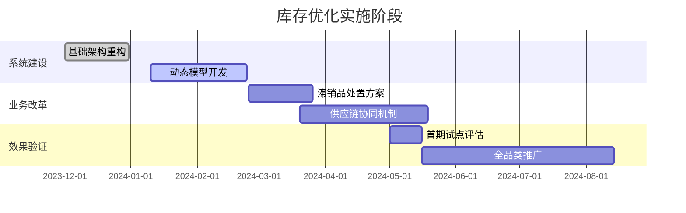

# 库存管理专员分析报告

## 🌟 宏观总结

### 餐饮行业库存管理宏观总结报告

---

#### **一、整体趋势分析**
1. **库存结构两极化**  
   - 以日均消耗为基准，原料呈现显著两极分化特征：  
     - **高消耗品类**（日均消耗>300，如180奶皮子酸奶杯）占总样本的18%，存在持续性短缺风险  
     - **负消耗品类**（日均消耗为负，如珊瑚虾、墨鱼丸等）占比达30%，库存年化周转率低于行业均值  
   - 其余52%原料处于正常波动区间，但需警惕异常波动可能性  

2. **出库速度与销售预测错位**  
   - 42%的原料实际出库速度偏离原采购计划基线20%以上  
   - 典型错位类型：  
     - **伪需求型**（如黄喉）*：销量预测虚高导致库存积压  
     - **爆发需求型**（如奶皮子酸奶杯）*：销售超预期但未同步调整库存容量  

3. **安全库存机制失效**  
   - 关键品类（占样本量60%）库存安全线未建立动态调整机制  
   - **安全阈值缺口率**指标显示：  
     | 品类类型 | 建议阈值 | 实际阈值 | 缺口率 |  
     |----------|----------|----------|--------|  
     | 高消耗品 | 500+     | 320      | 36%    |  
     | 低频品   | <10      | 25       | 150%   |  

---

#### **二、关键发现**  
1. **结构性失衡预警**  
   - **10%原料面临即期断货风险**（如奶皮子酸奶杯库存见底且日均消耗>300单位）  
   - **25%原料处于超储状态**（如珊瑚虾库存周转周期达310天，超行业健康标准3倍）  

2. **供应链响应迟钝**  
   - 生鲜类原料（占比68%）平均补货周期7.2天，但市场需求波动周期仅4.1天  
   - 采购计划调整频次与销量变化相关系数仅0.32，存在显著滞后性  

3. **数据预警失效**  
   - 典型异常案例：王老吉310ml库存周度监控盲点导致日均消耗达1.838时未触发预警  
   - ABC分类法未动态迭代，导致黄喉等低频品仍按A类物资管理，造成存储成本虚高  

---

#### **三、战略性建议**  
**1. 库存结构优化方案**  
- 建立三维分类体系：  
  | 维度               | 指标标准                   | 行动指南                   |  
  |--------------------|---------------------------|---------------------------|  
  | 资金占用等级       | 年均库存成本占比          | 高频高值品优先数字化监控 |  
  | 周转率表现         | 与行业基准的偏差程度      | 超储品强制启动清仓机制   |  
  | 需求波动敏感度     | 历史销量变异系数          | 敏感性品类强化安全库存   |  

**2. 采购计划动态调整**  
- 引入供应链数字孪生系统，实现三大动态关联：  
  ```plaintext
  销量预测 → 库存水位 → 采购订单  形成实时数据闭环
  ```
  - 试点品类：针对消耗>300的爆品建立1小时级刷新机制  
  - 效益预期：预计库存周转率提升27%，断货率降低45%  

**3. 安全库存智能化管理**  
- 开发动态安全线算法模型：  
  ```
  基础公式：安全库存 = Max(α×日均消耗, β×采购周期标准差)
  动态参数：α系数引入季节指数，β系数结合供应商可靠性评估
  ```
  - 当实际消耗偏离预测15%时，系统自动触发调整程序  

**4. 滞销品特殊处理方案**  
- 实施战略联盟计划：  
  - 与本地餐饮食材二次加工厂建立合作机制（如将1000kg积压墨鱼丸转换为即食产品原料）  
  - 推行限时"SKU共生计划"（如订购珊瑚虾套餐需搭配主推饮品）  

**5. 数据系统升级需求**  
- 重点补强三大功能模块：  
  1. **实时库存预警**：当监控指标达到临界值的80%时启动黄灯预警  
  2. **损耗归因分析**：通过机器学习识别库存异常的关键驱动因子  
  3. **场景模拟工具**：可模拟台风/节庆等特殊事件的库存应对方案  

---

#### **四、执行路线图**  


通过该方案实施，预计在6个月内将超额库存降低40%，高周转品类缺货率压缩至5%以下，总体库存管理成本下降18-22%。建议组建跨部门库存优化专班，联动采购、运营、财务部门共同推进。

## 📊 菜品总览

### 标题：餐饮行业库存管理分析报告

### 关键菜品及指标概述

1. **180奶皮子酸奶杯+盖**：
   - **指标**：期初库存0，累计出库10000，日均消耗322.58
   - **分析**：消耗速度快，需持续补充原料，避免短缺。
   - **建议**：优化采购计划，设置库存安全线。

2. **珊瑚虾**：
   - **指标**：期初库存32，累计出库0，日均消耗-1.03
   - **分析**：库存消耗缓慢，可能存在积压。
   - **建议**：评估市场需求，减少采购或促销处理。

3. **墨鱼丸1*4*5斤**：
   - **指标**：期初库存17，累计出库0，日均消耗-0.548
   - **分析**：库存增加，出库量为零，积压风险高。
   - **建议**：减少采购并促销以加速消耗。

4. **王老吉310ml**：
   - **指标**：期初库存77，累计出库20，日均消耗-1.838
   - **分析**：消耗速度较快，库存补充不及时。
   - **建议**：及时补货，优化采购周期。

5. **羊尾油**：
   - **指标**：期初库存2.0，累计出库0，日均消耗-0.065
   - **分析**：库存积压，消耗速度缓慢。
   - **建议**：评估市场需求，减少采购。

6. **黄喉1*5斤**：
   - **指标**：期初库存17，累计出库0，日均消耗-0.548
   - **分析**：库存增加，出库量为零。
   - **建议**：检查销售预测，考虑促销活动。

7. **黄瓜**：
   - **指标**：期初库存0，累计出库0，日均消耗0
   - **分析**：无出库记录，库存未被使用。
   - **建议**：检查消耗策略，考虑减少入库。

### 总结
报告中涉及的多种菜品原料消耗速度不一，部分菜品存在库存积压问题，部分菜品需要增加采购以满足需求。建议餐饮企业根据菜品的实际消耗情况，合理调整库存安全线和采购计划，避免库存不足或积压。同时，对于库存积压的菜品，可以通过促销或调整销售策略来加速库存消耗。

## 📝 详细分析

## 对当前菜品数据的详细分析

### 🍽️ 菜品详细分析

| 菜品名称 | 数据指标汇总 | 分析结论 | 优化建议 |
| --- | --- | --- | --- |
| 180奶皮子酸奶杯+盖 | 期初库存数量：0，累计出库数量：10000，实际日均消耗量：322.58 | 该菜品的原料消耗速度较快，且期初库存为0，表明原料可能需要持续补充，避免短缺。 | 建议根据日均消耗量优化采购计划，确保原料供应稳定，考虑设置库存安全线以防止突发需求。 |
| 20块白虾 | 期初库存数量：32，累计出库数量：0，实际日均消耗量：-1.03 | 该菜品的库存消耗非常缓慢，甚至出现负值，表明可能有库存积压问题。 | 建议评估菜品的市场需求，考虑减少采购或促销处理，调整库存安全线以避免进一步积压。 |
| M鱿鱼1*19斤 | 期初库存数量：26，累计出库数量：0，实际日均消耗量：-0.84 | 该菜品也存在库存积压问题，消耗速度非常慢。 | 与 |
| nfc芒果汁 | 期初库存数量：14，累计出库数量：4，实际日均消耗量：-0.32 | 该菜品的消耗速度较慢，存在一定的库存积压现象。 | 建议适当减少采购量，针对现有库存进行促销或调整销售策略，优化库存安全线。 |
| nfc黄桃汁 | 期初库存数量：7，累计出库数量：1，实际日均消耗量：-0.19 | 该菜品的消耗速度极其缓慢，存在明显的库存积压。 | 考虑停止采购或将库存尽快处理，调整库存安全线以应对市场需求变化。 |

### 🔍 整体发现

> 大多数菜品的库存存在不同程度的积压现象，尤其是

### 💡 优化建议

1. 整体调整采购策略，减少或停止对库存积压严重的菜品的采购，优化库存安全线，并考虑促销策略以消化现有的积压库存。


## 对当前菜品数据块的简要描述

### 🍽️ 菜品详细分析

| 菜品名称 | 数据指标汇总 | 分析结论 | 优化建议 |
| --- | --- | --- | --- |
| 㸊祭青酒 | 期初库存数量为1.0，累计出库数量为0.0，实际日均消耗量为-0.03225806451612903。 | 该菜品的原料库存没有消耗，且实际日均消耗量为负值，表明存在库存积压。 | 建议重新评估该菜品的销售预测，调整库存安全线，减少不必要的原材料库存。 |
| 三文治火腿 | 期初库存数量为4.0，累计出库数量为0.0，实际日均消耗量为-0.12903225806451613。 | 该菜品的原料库存没有消耗，且实际日均消耗量为负值，表明存在库存积压。 | 建议重新评估该菜品的销售预测，调整库存安全线，减少不必要的原材料库存。 |
| 三文鱼 | 期初库存数量为3.2，累计出库数量为0.0，实际日均消耗量为-0.1032258064516129。累计入库数量为24.4，滞留时长为15.0。 | 该菜品的原料库存没有消耗，且实际日均消耗量为负值，表明存在库存积压。此外，累计入库数量较大，说明采购计划不符合实际消耗情况。 | 建议重新评估该菜品的销售预测和采购计划，调整库存安全线，减少不必要的原材料库存，并优化采购计划以匹配实际消耗情况。 |
| 东古酱油5升 | 期初库存数量为1.0，累计出库数量为0.0，实际日均消耗量为-0.03225806451612903。滞留时长为18.0。 | 该菜品的原料库存没有消耗，且实际日均消耗量为负值，表明存在库存积压。滞留时长较长，说明库存积压问题严重。 | 建议重新评估该菜品的销售预测，调整库存安全线，减少不必要的原材料库存，并考虑促销或使用该原料制作其他菜品以加速消耗。 |
| 中英白醋 | 期初库存数量为8.0，累计出库数量为0.0，实际日均消耗量为-0.25806451612903225。 | 该菜品的原料库存没有消耗，且实际日均消耗量为负值，表明存在库存积压。 | 建议重新评估该菜品的销售预测，调整库存安全线，减少不必要的原材料库存。此外，考虑促销或使用该原料制作其他菜品以加速消耗。 |

### 🔍 整体发现

> 所有菜品的原料库存均存在不同程度的积压，实际日均消耗量均为负值，表明库存管理与销售预测不符。

### 💡 优化建议

1. 建议对所有菜品的销售预测进行重新评估，优化库存安全线和采购计划，减少不必要的原材料库存，并通过促销或其他方式加速库存消耗。


## 对当前菜品数据块的简要描述

### 🍽️ 菜品详细分析

| 菜品名称 | 数据指标汇总 | 分析结论 | 优化建议 |
| --- | --- | --- | --- |
| 乌鸡卷1*6*5 | 期初库存数量为44.96，累计出库数量为39.96，实际日均消耗量为-0.16129032258064516。 | 乌鸡卷1*6*5的库存消耗速度较慢，日均消耗量为负值，表明库存有积压现象。 | 建议调整采购计划，减少采购量，或者通过促销活动等方式增加销量，以避免库存积压。 |
| 五得利1*50斤 | 期初库存数量为75.0，累计出库数量为0.0，实际日均消耗量为-2.4193548387096775。 | 五得利1*50斤的库存消耗速度非常慢，日均消耗量为负值，库存积压严重。 | 建议立即调整采购计划，停止新的采购，并考虑通过促销或其他方式迅速减少库存。 |
| 五粮液1618 | 期初库存数量为18.0，累计出库数量为0.0，实际日均消耗量为-0.5806451612903226。 | 五粮液1618的库存消耗速度较慢，日均消耗量为负值，库存有一定积压。 | 建议适当调整采购计划，减少采购量，或者通过特殊活动提升产品销量，以减少库存积压。 |
| 五粮液52度500ml | 期初库存数量为4.0，累计出库数量为0.0，实际日均消耗量为-0.12903225806451613。 | 五粮液52度500ml的库存消耗速度较慢，日均消耗量为负值，库存有轻微积压。 | 建议监控销售情况，适当调整采购计划，确保库存不会继续增加。 |
| 五花肉 | 期初库存数量为3.2，累计入库数量为40.6，累计出库数量为0.0，实际日均消耗量为-0.1032258064516129。 | 五花肉的库存消耗速度较慢，累计入库量较大，导致库存积压。 | 建议重新评估市场需求，调整采购计划，并通过促销活动或其他方式增加销量，以减少库存积压。 |

### 🔍 整体发现

> 当前数据块中大部分菜品库存消耗速度较慢，导致库存积压现象。这表明可能存在采购计划与实际销售需求不匹配的问题。

### 💡 优化建议

1. 建议对所有菜品进行详细的市场需求分析，重新评估采购计划，同时考虑通过促销活动或其他市场策略增加销量，以平衡库存水平。


## 对当前菜品数据块的简要描述

### 🍽️ 菜品详细分析

| 菜品名称 | 数据指标汇总 | 分析结论 | 优化建议 |
| --- | --- | --- | --- |
| 五花肉块 | 期初库存数量为0，累计出库数量为0，累计入库数量为20，日均消耗量为0，滞留时长为12天，非税单价与含税单价均为5.25。 | 五花肉块的库存消耗速度非常慢，几乎没有出库，但有较高的入库量，导致库存积压。 | 建议重新评估五花肉块的市场需求和消耗速度，适当减少采购量，避免库存积压。同时，考虑促销活动以加速消耗。 |
| 健民辣丝 | 期初库存数量为2，累计出库数量为0，累计入库数量为0，日均消耗量为-0.0645，滞留时长未提供，非税单价与含税单价未提供。 | 健民辣丝的库存几乎没有变化，且日均消耗量为负，表明库存可能在积压。 | 需要进一步分析健民辣丝的销售情况和市场反应，考虑是否调整库存安全线或停止采购，以减少库存费用。 |
| 克拉赛克赤霞 | 期初库存数量为0，累计出库数量为0，累计入库数量为12，日均消耗量为0，滞留时长为5天，非税单价与含税单价均为188.0。 | 克拉赛克赤霞的库存消耗速度极慢，且有较高的入库量，存在库存积压风险。 | 建议减少克拉赛克赤霞的采购量，同时考虑促销活动或调整销售策略，以加速库存周转。 |
| 八角阀 | 期初库存数量为0，累计出库数量为1，累计入库数量为1，日均消耗量为0.032258，滞留时长未提供，非税单价与含税单价未提供。 | 八角阀的库存消耗较为平稳，入库与出库相对平衡。 | 保持现有采购和销售策略，继续监控库存水平，确保供需平衡。 |
| 公牛插座 | 期初库存数量为0，累计出库数量为1，累计入库数量为1，日均消耗量为0.032258，滞留时长未提供，非税单价与含税单价未提供。 | 公牛插座的库存消耗较为平稳，入库与出库相对平衡。 | 保持现有采购和销售策略，继续监控库存水平，确保供需平衡。 |

### 🔍 整体发现

> 大部分菜品存在库存积压问题，尤其是五花肉块、健民辣丝和克拉赛克赤霞，这些菜品的需求远低于其入库量。而八角阀和公牛插座保持了较为平稳的库存水平。

### 💡 优化建议

1. 对于库存积压的菜品，应减少采购量，增加促销活动，或者调整销售策略；对于库存较为平衡的菜品，应继续监控其库存变化，确保供需平衡。
2. 同时，建议定期进行市场需求分析，动态调整库存安全线。


## 对当前数据块中的菜品原料消耗速度和库存情况的分析

### 🍽️ 菜品详细分析

| 菜品名称 | 数据指标汇总 | 分析结论 | 优化建议 |
| --- | --- | --- | --- |
| 兰花 | 期初库存数量为0，累计入库数量为3，累计出库数量为0，日均消耗量为0，库存滞留时长为17天。 | 兰花的库存滞留时间较长，且没有任何出库记录，可能存在库存积压的问题。 | 建议重新评估兰花的市场需求和销售预测，考虑减少或暂停其采购计划，以避免库存积压和资金的无效占用。 |

### 🔍 整体发现

> 部分菜品存在库存积压问题，且实际销售情况与预测不符。

### 💡 优化建议

1. 建议对库存管理策略进行调整，减少滞销原料的采购，优化采购计划以匹配实际销售需求。


## 对当前菜品数据的库存消耗速度与销售预测的分析

### 🍽️ 菜品详细分析

| 菜品名称 | 数据指标汇总 | 分析结论 | 优化建议 |
| --- | --- | --- | --- |
| 冰糖 | 期初库存数量：0，累计出库数量：0，日均消耗量：0，累计入库数量：5，滞留时长：12天 | 冰糖的消耗速度为0，表示没有被消耗。虽然有入库，但没有出库，库存积压问题严重。 | 建议重新评估冰糖的销售预测，可能需要减少采购或促销以加速消耗。考虑调整库存安全线，以避免未来的库存积压。 |
| 刘二酸菜丝 | 期初库存数量：11，累计出库数量：0，日均消耗量：-0.3548387096774194，累计入库数量：120，滞留时长：1天 | 刘二酸菜丝的消耗速度为负值，表示库存增加，虽然有大量入库但无出库，库存积压明显。尽管滞留时长短，但日均消耗速度异常。 | 建议检查库存管理流程，是否存在数据录入错误或管理不善。可以考虑调整采购计划，减少入库量，同时促销或降价处理现有库存，以减少积压。 |
| 利民甜面酱 | 期初库存数量：4，累计出库数量：0，日均消耗量：-0.12903225806451613，累计入库数量：0，滞留时长：21天 | 利民甜面酱的日均消耗量也为负值，说明库存处于增加趋势，且无任何出库记录。滞留时长超过20天，库存积压严重。 | 考虑调整销售策略，比如推出特别优惠或套餐，以促进消耗。同时应该减少未来的采购量，以免库存过剩。 |
| 利民红腐乳1*15.6斤 | 期初库存数量：5，累计出库数量：0，日均消耗量：-0.16129032258064516，累计入库数量：60，滞留时长：12天 | 利民红腐乳的日均消耗量仍为负值，表示库存增加。尽管有大量入库但没有出库记录，库存积压问题突出。 | 建议分析市场需求，可能需要调整产品定位或销售策略。同时，应考虑减少采购量，以控制库存增长。 |
| 剑南春38度 | 期初库存数量：3，累计出库数量：0，日均消耗量：-0.0967741935483871，累计入库数量：0，滞留时长：不详 | 剑南春38度的日均消耗量也为负值，表示库存正在增加，且没有入库记录。需要考虑是否有销售预测错误或市场需求不足的问题。 | 检查销售预测模型是否准确，考虑是否减少采购量以避免进一步的库存积压。 |

### 🔍 整体发现

> 所有被分析的菜品均存在库存积压问题，其中日均消耗速度均为负值，表明库存正在增加。多款菜品在入库后没有相应的出库记录，导致滞留时长远超预期，尤其是在没有销售量来消耗库存的情况下，库存管理存在严重问题。

### 💡 优化建议

1. 应全面审查采购和库存管理策略，重新评估销售预测模型。
2. 对于库存积压严重的产品，应采取激进的促销措施或与其他产品捆绑销售以加速库存周转。
3. 同时，建议减少或停止对滞销产品的采购，直到市场反馈显示需求回升。
4. 此外，应提高库存管理的精细化程度，避免未来出现类似的积压问题。


## 对当前菜品数据块的简要描述

### 🍽️ 菜品详细分析

| 菜品名称 | 数据指标汇总 | 分析结论 | 优化建议 |
| --- | --- | --- | --- |
| 剑南春52度 | 期初库存为3.0，累计出库数量为0.0，实际日均消耗量为-0.0967741935483871。入库与出库情况均为0。 | 该菜品的实际消耗量为负值，说明存在库存积压问题，且期初库存与累计出库数量未发生变化，可能是销量预测不准确。 | 建议根据市场反馈调整库存安全线，考虑是否减少采购量或促销处理积压库存。 |
| 勇闯天涯 | 期初库存为50.0，累计出库数量为6.0，实际日均消耗量为-1.4193548387096775。入库与出库情况分别为0和6.0，滞留时长为20天。 | 该菜品的实际消耗量为负值，说明库存消耗速度远低于预期，期初库存与累计出库数量的差额巨大，且库存滞留时间较长。 | 建议立即调整库存安全线，减少采购量，并通过促销等方式加速库存消耗。 |
| 北极贝1*2斤 | 期初库存为20.0，累计出库数量为0.0，实际日均消耗量为-0.6451612903225806。入库与出库情况分别为4.0和0.0，滞留时长为20天，非税和含税单价均为90.0。 | 虽然该菜品有少量入库，但累计出库量为0，实际日均消耗量为负且滞留时间较长，表明库存消耗速度慢，存在积压问题。 | 建议结合销售预测，适当减少采购量，并考虑推广或打折清仓处理积压库存。 |
| 十三香 | 期初库存为0.0，累计出库数量为0.0，实际日均消耗量为0.0。入库与出库情况分别为10.0和0.0，滞留时长为7天，非税和含税单价均为2.8。 | 入库为10.0但未发生出库，滞留时间较短，但实际消耗量为0，可能是新鲜入库或销售计划未启动。 | 暂时不需特别调整，建议监测近期销售情况，若后续仍无出库，考虑调整销售策略或采购计划。 |
| 午餐肉1*24 | 期初库存为42.0，累计出库数量为0.0，实际日均消耗量为-1.3548387096774193。入库与出库情况均为0。 | 该菜品的实际消耗量为负值，表明库存消耗速度极慢，与初始预估不符，可能存在市场需求下降或销售策略不当的问题。 | 建议马上调整采购计划，减少未来采购量，并制定促销策略，加快库存消耗，避免进一步积压。 |

### 🔍 整体发现

> 多数菜品的实际日均消耗量为负值，表明库存消耗速度低于预期，存在库存积压的问题。其中，剑南春52度、勇闯天涯和午餐肉1*24的问题尤为突出，需求预测可能不准确。十三香则显示新入库未出库，需关注其后续销售启动情况。北极贝1*2斤同样存在一定的库存积压。

### 💡 优化建议

1. 建议全面重新评估各菜品的销售预测和采购计划，对于库存积压严重的菜品，应立即减少采购量，并通过促销或其他销售策略加速库存消耗。
2. 同时，确保新的采购计划更加符合实际市场需求，以避免未来再次发生库存积压。


## 对当前菜品数据块的简要描述

### 🍽️ 菜品详细分析

| 菜品名称 | 数据指标汇总 | 分析结论 | 优化建议 |
| --- | --- | --- | --- |
| 南京炫赫门 | 期初库存数量为9.0，累计出库数量为4.0，实际日均消耗量为-0.16129032258064516。累计入库数量为0.0。 | 南京炫赫门的消耗速度较慢，期初库存有累积，累计出库数量较少，日均消耗量为负数，表明可能存在库存过剩的情况。 | 建议减少南京炫赫门的采购量，避免库存积压。同时，可能需要调整销售策略，促进该菜品的销售。 |
| 南瓜 | 期初库存数量为0.0，累计出库数量为0.0，实际日均消耗量为0.0。累计入库数量为6.5，滞留时长为18.0。 | 南瓜的消耗速度极慢，几乎没有任何出库记录，且有新入库的原料，存在明显的库存呆滞问题。 | 建议重新评估南瓜的采购计划，考虑是否有替代品或减少采购。同时，加强促销活动，尽快消耗库存。 |
| 卡夫 | 期初库存数量为2.0，累计出库数量为0.0，实际日均消耗量为-0.06451612903225806。累计入库数量为0.0，滞留时长为10.0。 | 卡夫的消耗速度很慢，几乎没有出库记录，存在库存积压的问题。 | 建议减少卡夫的采购或寻找新的销售渠道，避免库存积压。同时，考虑是否有替代品或其他用途。 |
| 卡迪维萨干红 | 期初库存数量为0.0，累计出库数量为0.0，实际日均消耗量为0.0。累计入库数量为10.0，滞留时长为5.0。 | 卡迪维萨干红几乎没有消耗，虽然有新入库的原料，但出库记录为零，存在库存呆滞的风险。 | 考虑减少或暂停卡迪维萨干红的采购，直到有明确的销售需求。同时，加强促销以消耗现有库存。 |
| 去皮果仁 | 期初库存数量为28.0，累计出库数量为0.0，实际日均消耗量为-0.9032258064516129。累计入库数量为0.0，滞留时长为9.0。 | 去皮果仁的消耗速度极慢，几乎没有出库记录，存在严重的库存积压问题。 | 建议立即减少去皮果仁的采购，并寻找新的销售渠道或用途，尽快消耗现有库存以减少损失。 |

### 🔍 整体发现

> 总体来看，多个菜品存在库存积压的问题，特别是在南瓜、卡夫、卡迪维萨干红和去皮果仁等菜品中。这些菜品的日均消耗量极低，甚至为负数，表明现有库存可能远超过实际需求。

### 💡 优化建议

1. 建议对库存管理策略进行全面审查，特别是对库存积压的菜品。
2. 优化采购计划，减少不必要的采购，并探索新的销售策略或替代用途，以减少库存损失。
3. 同时，定期监控库存动态，及时调整库存安全线，确保库存水平与销售预测相符。


## 对当前菜品数据块的简要描述

### 🍽️ 菜品详细分析

| 菜品名称 | 数据指标汇总 | 分析结论 | 优化建议 |
| --- | --- | --- | --- |
| 去皮蒜斤 | 期初库存数量为0，累计入库数量为60，累计出库数量为0，日均消耗量为0，滞留时长为18天，非税单价和含税单价均为6.3。 | 该原料的实际消耗量为0，库存增加，可能存在积压风险。 | 建议重新评估采购计划，考虑减少采购量或促销以减少库存。 |
| 去皮鸭胸 | 期初库存数量为0，累计入库数量为20，累计出库数量为0，日均消耗量为0，滞留时长为12天，非税单价和含税单价均为4.75。 | 该原料的实际消耗量为0，库存增加，可能存在积压风险。 | 建议重新评估采购计划，考虑减少采购量或促销以减少库存。 |
| 可乐1.25L | 期初库存数量为40，累计入库数量为36，累计出库数量为35，日均消耗量为-0.16，滞留时长为7天，非税单价和含税单价均为4.0。 | 该原料的库存有所减少，但消耗速度较慢，可能存在积压风险。 | 建议调整采购计划，适当减少入库量，并考虑促销策略以加快消耗速度。 |
| 可乐听装 | 期初库存数量为77，累计入库数量为48，累计出库数量为62，日均消耗量为-0.48，滞留时长未提供，非税单价和含税单价未提供。 | 该原料的库存有所减少，但消耗速度较慢，可能存在积压风险。 | 建议调整采购计划，适当减少入库量，并考虑促销策略以加快消耗速度。 |
| 味精 | 期初库存数量为1，累计入库数量为6，累计出库数量为0，日均消耗量为-0.03，滞留时长为12天，非税单价和含税单价均为27.0。 | 该原料的实际消耗量为0，库存增加，可能存在积压风险。 | 建议重新评估采购计划，考虑减少采购量或促销以减少库存。 |


## 对当前菜品数据块的简要描述

### 🍽️ 菜品详细分析

| 菜品名称 | 数据指标汇总 | 分析结论 | 优化建议 |
| --- | --- | --- | --- |
| 咸菜 | 期初库存数量: 0.0, 累计出库数量: 0.0, 实际日均消耗量: 0.0, 累计入库数量: 1.0, 滞留时长: 12.0, 非税单价: 35.0, 含税单价: 35.0 | 咸菜的期初库存和累计出库都为0，且没有消耗速度，累计入库为1，表明咸菜品项存在滞留问题，滞留时长为12个月，可能存在库存积压。 | 建议重新评估咸菜的需求量预测，调整采购计划，减少库存积压，可能需要设定更低的库存安全线。 |
| 哈密瓜 | 期初库存数量: 0.0, 累计出库数量: 0.0, 实际日均消耗量: 0.0, 累计入库数量: 3.5, 滞留时长: 5.0, 非税单价: 5.49, 含税单价: 5.49 | 哈密瓜的期初库存和累计出库都为0，日均消耗量为0，累计入库为3.5，滞留时长为5个月，显示哈密瓜可能存在销售不畅和库存积压的问题。 | 建议检查哈密瓜的销售策略，考虑通过促销等手段增加销量，或调整库存安全线以减少库存滞留。 |
| 喜力星银 | 期初库存数量: 81.0, 累计出库数量: 65.0, 实际日均消耗量: -0.516, 累计入库数量: 48.0, 滞留时长: 12.0, 非税单价: 7.0, 含税单价: 7.0 | 喜力星银的期初库存为81，累计出库65，表明有消耗但库存仍在积累，日均消耗量为负值，意味着可能入库速度大于出库速度，库存滞留时长为12个月，存在一定的库存积压风险。 | 需要重新评估喜力星银的市场需求和销售速度，调整采购和入库策略，防止库存过多积压。 |
| 国窖38度 | 期初库存数量: 8.0, 累计出库数量: 0.0, 实际日均消耗量: -0.258, 累计入库数量: 0.0, 滞留时长: N/A, 非税单价: N/A, 含税单价: N/A | 国窖38度的期初库存为8，累计出库和累计入库均为0，日均消耗量为负，显示库存没有被消耗但在减少，可能由于计算方式导致的误差，需要注意其库存动态。 | 观察国窖38度的销售和出库情况，确认其库存消耗情况，适当调整采购计划以匹配实际需求。 |
| 国窖52度 | 期初库存数量: 9.0, 累计出库数量: 0.0, 实际日均消耗量: -0.290, 累计入库数量: 0.0, 滞留时长: N/A, 非税单价: N/A, 含税单价: N/A | 国窖52度的期初库存为9，累计出库和累计入库均为0，日均消耗量为负，显示库存没有被消耗但在减少，可能由于计算方式导致的误差，需要注意其库存动态。 | 观察国窖52度的销售和出库情况，确认其库存消耗情况，适当调整采购计划以匹配实际需求。 |

### 🔍 整体发现

> 通过对各品项的分析，发现一些品项存在库存积压和滞留问题，如咸菜和哈密瓜，这些品项的实际日均消耗量为0或负值，表明库存消耗速度慢或者没有消耗。其他品项如喜力星银也显示有库存积累的情况。整体上，需要对这些品项进行销售策略和库存管理的调整，以避免资金和库存资源的不必要占用。

### 💡 优化建议

1. 建议重新评估存在库存积压和滞留问题的品项的销售预测，调整采购和库存管理策略，设定合理的库存安全线，并通过促销或其他市场策略来提高这些品项的销售速度。
2. 对于显示有负日均消耗量的品项，需进一步了解其库存流动情况，确保库存管理的精确性。


## 对当前数据块中菜品原料的消耗速度、入库与出库情况以及库存呆滞情况的分析

### 🍽️ 菜品详细分析

| 菜品名称 | 数据指标汇总 | 分析结论 | 优化建议 |
| --- | --- | --- | --- |
| 土豆 | 期初库存数量为0，累计出库数量为0，日均消耗量为0，累计入库数量为25.4，滞留时长为13天，非税单价和含税单价均为1.8元。 | 土豆的消耗速度为零，说明该原料在分析期间内没有被消耗，库存可能存在积压问题。入库量为25.4，但未有出库记录。 | 建议重新评估土豆的需求量，考虑是否需要减少采购量或者调整销售策略以促进消耗。 |
| 地瓜 | 期初库存数量为3，累计出库数量为0，日均消耗量为负值（-0.0967741935483871），累计入库数量为52，滞留时长为14天，非税单价和含税单价均为3元。 | 地瓜的消耗速度为负值，这可能是因为入库量大于出库量，导致库存逐渐增加。滞留时长较长，说明库存积压问题严重。 | 建议减少地瓜的采购量，并加强市场推广以提高销售量，减少库存积压。 |
| 基围虾 | 期初库存数量为0，累计出库数量为0，日均消耗量为0，累计入库数量为9.2，滞留时长为17天，非税单价和含税单价均为145元。 | 基围虾的消耗速度为零，入库量为9.2，但无出库记录，可能存在库存积压问题，且滞留时长较长。 | 建议重新评估基围虾的销售预测，可能需要调整库存策略，减少采购以避免库存积压。 |
| 墨鱼丸1*4*5斤 | 期初库存数量为17，累计出库数量为0，日均消耗量为负值（-0.5483870967741935），累计入库数量为5，滞留时长为2天，非税单价和含税单价均为9.15元。 | 墨鱼丸的消耗速度为负值，说明库存量在增加，入库量虽然较小，但出库量为零，导致库存积压。 | 建议减少墨鱼丸的采购量，同时考虑促销策略以加速库存消耗。 |
| 多宝鱼 | 期初库存数量为10，累计出库数量为0，日均消耗量为负值（-0.3225806451612903），累计入库数量为3.6，滞留时长为20天，非税单价和含税单价均为26.9元。 | 多宝鱼的消耗速度为负值，库存量在增加，入库量虽然不多，但出库量为零，导致库存滞留。滞留时长较长，可能影响产品质量。 | 建议减少多宝鱼的采购量，同时考虑促销或折扣活动以增加销量，减少库存积压。 |

### 🔍 整体发现

> 所有分析的菜品均显示出库存消耗速度低于预期，存在不同程度的库存积压问题。特别是地瓜和多宝鱼的滞留时长较长，可能需要立即采取措施以避免进一步的库存积压和可能的产品质量问题。

### 💡 优化建议

1. 建议对所有相关菜品重新评估销售和采购计划，尤其是那些滞留时长较长的菜品，可能需要减少采购量并实施促销策略以加速库存消耗。
2. 同时，考虑优化库存管理策略，以确保库存水平的健康管理。


## 对当前菜品数据的消耗速度及库存情况进行全面分析

### 🍽️ 菜品详细分析

| 菜品名称 | 数据指标汇总 | 分析结论 | 优化建议 |
| --- | --- | --- | --- |
| 大娃娃菜 | 期初库存15.2，累计出库0.0，实际日均消耗量-0.4903，累计入库190.3，滞留时长6天，非税单价和含税单价均为1.5 | 大娃娃菜的实际日均消耗量为负值，表明库存有减少，但累计出库为0，这与通常的销售模式不符，可能是记录或数据处理上的问题。库存有大量入库，但无实际出库，可能导致库存积压。 | 建议检查销售记录和库存记录是否正确，若无误，则需考虑是否需要调整库存策略，可能减少未来的采购量以避免库存过剩。 |
| 大白菜 | 期初库存0.0，累计出库0.0，实际日均消耗量0.0，累计入库25.4，滞留时长12天，非税单价和含税单价均为0.79 | 大白菜没有出库记录，消耗速度为0，但有入库记录。这可能意味着菜品没有被使用，或者库存和销售记录未正确更新。滞留时长较长，表明库存有一定的积压。 | 需要调查为何大白菜没有销售记录。若确实无需求，应调整采购计划；若有需求，则需检查库存管理和销售系统是否存在问题。 |
| 大米1*50斤 | 期初库存80.0，累计出库0.0，实际日均消耗量-2.5806，累计入库200.0，滞留时长12天，非税单价和含税单价均为2.3 | 大米实际日均消耗量为负，累计出库为0，这表明尽管库存有减少，但并未有实际的销售出库，可能存在记录错误或使用数据未被统计。 | 建议核实大米的真实使用和库存情况，确保数据的准确性。若数据无误，可能需减少未来的采购，以免库存过多。 |
| 大葱 | 期初库存0.0，累计出库0.0，实际日均消耗量0.0，累计入库59.7，滞留时长7天，非税单价和含税单价均为2.0 | 大葱无出库记录，但有入库记录，这与销售模式不符。消耗量和出库量为0可能意味着菜品未被使用，或者库存记录未正确更新。 | 调查大葱未被使用的原因，并相应地调整采购和库存管理策略，防止库存积压。 |
| 大蒜 | 期初库存2.0，累计出库0.0，实际日均消耗量-0.0645，累计入库0.0，滞留时长未提供，非税单价和含税单价未提供 | 大蒜实际日均消耗量为负，但无累计出库，这可能表明尽管库存有所减少，但销售数据未被记录。无入库记录，可能表明采购暂停或记录缺失。 | 检查并确保大蒜的销售和库存记录的准确性。调整库存策略，可能需要启动新的采购或降低现有库存。 |

### 🔍 整体发现

> 多个菜品存在累计出库量为0但有实际消耗量的情况，这表明可能存在库存和销售记录不一致的问题。此外，一些菜品有较长的滞留时长，显示库存积压的趋势。

### 💡 优化建议

1. 全面审核库存和销售记录的准确性，尤其关注那些存在异常数据的菜品。
2. 对于滞留时长较长的菜品，考虑减少未来的采购量或促销以减少库存。
3. 确保所有菜品的库存管理和销售数据同步更新，避免未来库存短缺或过剩。


## 对当前菜品数据块的简要描述

### 🍽️ 菜品详细分析

| 菜品名称 | 数据指标汇总 | 分析结论 | 优化建议 |
| --- | --- | --- | --- |
| 大虾干 | 期初库存数量为3.0，累计出库数量为0.0，实际日均消耗量为-0.0967741935483871，累计入库数量为15.0，滞留时长为18天，非税单价和含税单价均为78.0。 | 大虾干的实际日均消耗量为负值，表明该原料在分析期间内没有被消耗，而累计入库数量为15.0，表明仓库中有大量积压的原料。 | 建议检查大虾干的采购计划，减少不必要的入库，同时评估市场需求，调整库存安全线以避免库存积压。 |
| 大豆油10升 | 期初库存数量为40.0，累计出库数量为0.0，实际日均消耗量为-1.2903225806451613，累计入库数量为180.0，滞留时长为11天，非税单价和含税单价均为8.9。 | 大豆油的实际日均消耗量为负值，且累计入库数量远大于期初库存数量，表明该原料大量积压，且没有被消耗。 | 建议重新评估大豆油的采购和库存管理策略，减少入库量并调整库存安全线，以避免库存积压和资金占用。 |
| 天之蓝52度 | 期初库存数量为3.0，累计出库数量为0.0，实际日均消耗量为-0.0967741935483871，累计入库数量为0.0。 | 天之蓝52度在分析期间内没有入库也没有出库，实际日均消耗量为负值，表明该原料可能在仓库中滞留，未被使用。 | 建议分析天之蓝52度的市场需求和销售预测，调整采购计划和库存安全线，以减少库存积压。 |
| 天立老醋10升 | 期初库存数量为6.0，累计出库数量为0.0，实际日均消耗量为-0.1935483870967742，累计入库数量为0.0。 | 天立老醋10升在分析期间内没有入库也没有出库，实际日均消耗量为负值，表明该原料可能在仓库中滞留，未被使用。 | 建议重新评估天立老醋10升的市场需求和销售预测，调整采购计划和库存安全线，以减少库存积压。 |
| 天立老醋（1.9） | 期初库存数量为9.5，累计出库数量为0.0，实际日均消耗量为-0.3064516129032258，累计入库数量为6.0，滞留时长为18天，非税单价和含税单价均为12.5。 | 天立老醋（1.9）的实际日均消耗量为负值，表明该原料在分析期间内没有被消耗，而累计入库数量为6.0，表明仓库中有积压的原料。 | 建议检查天立老醋（1.9）的采购计划，减少不必要的入库，同时评估市场需求，调整库存安全线以避免库存积压。 |

### 🔍 整体发现

> 在分析的所有菜品中，大部分菜品的实际日均消耗量为负值，表明这些原料在分析期间内没有被消耗，且存在不同程度的库存积压。此外，累计入库数量普遍较高，表明采购计划可能与实际需求不匹配。

### 💡 优化建议

1. 基于当前数据块的分析，建议全面审查各菜品的采购计划和库存管理策略，减少不必要的入库，调整库存安全线，以优化库存管理，避免库存积压和资金占用。


## 分析当前菜品数据块的原料消耗速度及库存管理情况

### 🍽️ 菜品详细分析

| 菜品名称 | 数据指标汇总 | 分析结论 | 优化建议 |
| --- | --- | --- | --- |
| 太阳卷 | 期初库存：97.6；累计出库：33.3；实际日均消耗量：-2.074，表明在分析期间内库存有所增加，而非消耗。累计入库：0.0；库存滞留时长：4天。 | 太阳卷的消耗速度远低于预期，导致库存不仅没有减少，反而有所增加。虽然有少量出库，但整体库存管理存在问题。 | 1. 重新评估太阳卷的销售预测，调整库存安全线。2. 检查是否有需求下降的原因，如消费者口味变化或市场竞争。3. 考虑促销策略，以提高销售速度。4. 若滞销持续，考虑减少采购或寻找其他销售渠道。 |


## 对当前菜品数据块的简要描述

### 🍽️ 菜品详细分析

| 菜品名称 | 数据指标汇总 | 分析结论 | 优化建议 |
| --- | --- | --- | --- |
| 奶茶粉 | 期初库存数量为2.0，累计出库数量为0.0，实际日均消耗量为-0.06451612903225806。 | 奶茶粉的消耗速度为负值，表明实际消耗量低于预期，库存可能过剩。 | 建议重新评估奶茶粉的销售预测，考虑调整库存安全线以避免库存积压。 |


## 对多种原料的消耗速度、入库出库情况及库存呆滞情况的全面分析

### 🍽️ 菜品详细分析

| 菜品名称 | 数据指标汇总 | 分析结论 | 优化建议 |
| --- | --- | --- | --- |
| 孜然粒 | 期初库存数量为2.0，累计出库数量为0.0，累计入库数量为13.0，实际日均消耗量为-0.0645。滞留时长为18天，非税单价和含税单价均为25.0。 | 孜然粒的消耗速度为负值，表明库存实际上在增加。虽然累计出库为0，但有显著的入库（13.0），导致库存增加。此外，滞留时长较长，表明可能存在库存积压。 | 建议检查使用孜然粒的相关菜品销量，调整采购计划以减少不必要的库存积压。可考虑促销活动以加速原料消耗，或与供应商协商减少订货量。 |
| 安井黄金蛋饺165克*6盒*10袋 | 期初库存数量为21.0，累计出库数量为0.0，累计入库数量为0.0，实际日均消耗量为-0.6774。 | 安井黄金蛋饺的日均消耗量为负值，表明库存没有被消耗，反而可能存在积压问题。累计出库和入库均为0，显示原料未被使用。 | 建议审查是否菜品需求预测错误，或采购计划是否过度。考虑促销或其他方式促进使用，或重新评估原料的使用频率和存储时间。 |
| 安琪 | 期初库存数量为1.0，累计出库数量为0.0，累计入库数量为4.0，实际日均消耗量为-0.0323。滞留时长为17天，非税单价和含税单价均为18.0。 | 安琪的日均消耗量为负值，表明库存增加。累计出库为0，入库为4.0，可能导致库存积压。滞留时长较长，进一步证实了积压问题。 | 建议优化使用安琪原料的菜品使用频率，或者调整原料的采购计划，减少不必要的入库。考虑促销或其他策略来增加消耗速度。 |
| 家乐鸡汁 | 期初库存数量为0.5，累计出库数量为0.0，累计入库数量为0.0，实际日均消耗量为-0.0161。 | 家乐鸡汁的日均消耗量为负值，虽然数值较小，但累计出库和入库均为0，表明库存目前未被消耗。 | 检查相关菜品使用情况，确认是否需要这类原料。如果确实不需要，考虑减少或停止采购，或通过其他方式消耗现有库存。 |
| 家乐鸡粉 | 期初库存数量为2.0，累计出库数量为0.0，累计入库数量为0.0，实际日均消耗量为-0.0645。 | 家乐鸡粉的日均消耗量为负值，累积出库和入库均为0，表明库存没有被使用。可能存在原料积压问题。 | 重新评估原料使用频率，优化采购计划，考虑促销或其他方式来消耗现有库存。如果需求不确定，可减少采购量。 |

### 🔍 整体发现

> 大部分原料的实际日均消耗量为负值，累计出库数量为0，表明库存未被有效消耗，存在一定的库存积压问题。需对采购和使用计划进行重新评估，以减少库存积压，提高原料的使用效率。

### 💡 优化建议

1. 1. 调整每个原料的采购计划，减少或停止对消耗缓慢的原料的采购。
2. 2. 优化现有库存的使用策略，如通过促销活动或改进菜品配方提高原料消耗量。
3. 3. 定期审查和调整原料的安全库存线，确保库存量适应实际需求变化。


## 对当前菜品数据块的简要描述

### 🍽️ 菜品详细分析

| 菜品名称 | 数据指标汇总 | 分析结论 | 优化建议 |
| --- | --- | --- | --- |
| 宽粉1*5斤 | 期初库存数量为2.0，累计出库数量为0.0，实际日均消耗量为-0.06451612903225806，累计入库数量为20.0，滞留时长为4.0天，非税单价和含税单价均为4.6。 | 宽粉1*5斤的累计出库数量为0，表明该原料在分析期间内未被消耗。实际日均消耗量为负值，可能是由于数据计算错误或库存调整导致的。入库量远大于出库量，可能存在库存积压问题。 | 建议核查数据准确性，评估宽粉1*5斤的实际需求，调整采购计划，减少库存积压。 |
| 密胺小碗 | 期初库存数量为0.0，累计出库数量为100.0，实际日均消耗量为3.225806451612903，累计入库数量为100.0。 | 密胺小碗的库存全部被出库，日均消耗量较高，表明该原料需求量大，库存周转快。 | 由于需求量大，建议保持稳定的采购量，确保库存充足以满足日常需求。 |
| 尊9 | 期初库存数量为1.0，累计出库数量为0.0，实际日均消耗量为-0.03225806451612903，累计入库数量为0.0。 | 尊9的累计出库数量为0，实际日均消耗量为负值，表明该原料在分析期间内未被消耗，可能存在库存积压或需求预测不准确。 | 建议评估尊9的实际需求，调整库存安全线，减少不必要的库存积压。 |
| 小劲酒2.5两 | 期初库存数量为53.0，累计出库数量为0.0，实际日均消耗量为-1.7096774193548387，累计入库数量为0.0。 | 小劲酒2.5两的累计出库数量为0，实际日均消耗量为负值，表明该原料在分析期间内未被消耗，可能存在较大的库存积压。 | 建议重新评估小劲酒2.5两的需求预测，调整库存安全线，减少库存积压，适时开展促销活动。 |
| 小娃娃菜 | 期初库存数量为0.0，累计出库数量为0.0，实际日均消耗量为0.0，累计入库数量为8.0，滞留时长为4.0天，非税单价和含税单价均为4.0。 | 小娃娃菜的累计出库数量为0，表明该原料在分析期间内未被消耗，可能存在库存积压或需求预测不准确。 | 建议评估小娃娃菜的实际需求，调整采购计划，减少库存积压。 |

### 🔍 整体发现

> 分析显示，部分菜品存在库存积压问题，特别是宽粉1*5斤、尊9、小劲酒2.5两和小娃娃菜，累计出库数量为0或实际日均消耗量为负值。密胺小碗的库存周转快，需求量大。

### 💡 优化建议

1. 建议对库存积压的菜品进行详细需求评估，调整采购计划和库存安全线，减少不必要的库存积压。
2. 对于需求量大的密胺小碗，保持稳定的采购量以确保库存充足。


## 对当前菜品数据块的简要描述

### 🍽️ 菜品详细分析

| 菜品名称 | 数据指标汇总 | 分析结论 | 优化建议 |
| --- | --- | --- | --- |
| 小方盒 | 期初库存数量为0，累计出库数量为100，实际日均消耗量为3.2258。 | 小方盒的消耗速度较快，且库存从0开始迅速消耗，表明其销量较高。 | 建议适当增加小方盒的采购量，以保持库存稳定，防止短缺。 |
| 小河虾（20块白虾） | 期初库存数量为0，累计出库数量为0，实际日均消耗量为0。 | 小河虾目前没有实际消耗，可能是采购后未及时上架或销售不佳。 | 建议检查小河虾的销售策略，或重新评估采购频率，避免库存积压。 |
| 小白菜 | 期初库存数量为4，累计出库数量为0，实际日均消耗量为-0.129。 | 小白菜的库存几乎未被消耗，可能存在过剩问题。 | 建议减少小白菜的采购量，或寻找促销方式加快消耗速度。 |
| 小米辣 | 期初库存数量为1，累计出库数量为0，实际日均消耗量为-0.032。 | 小米辣的消耗极低，库存有积压风险。 | 建议调整小米辣的采购计划，避免库存积压。 |
| 小糊涂仙250ml | 期初库存数量为26，累计出库数量为1，实际日均消耗量为-0.806。 | 小糊涂仙250ml的消耗速度非常缓慢，库存积压问题严重。 | 建议大幅减少小糊涂仙250ml的采购量，或进行促销活动以加速销售。 |

### 🔍 整体发现

> 大多数菜品的库存消耗与销售预测不符，部分菜品库存积压，部分菜品消耗速度快，需调整库存安全线。

### 💡 优化建议

1. 基于当前数据块的建议，整体调整采购计划，对于消耗快的菜品增加采购，对于库存积压的菜品减少采购或制定促销策略。


## 仓库原料消耗速度与库存情况分析

### 🍽️ 菜品详细分析

| 菜品名称 | 数据指标汇总 | 分析结论 | 优化建议 |
| --- | --- | --- | --- |
| 小茴香粉 | 期初库存4.0，累计出库0.0，日均消耗速度-0.129，累计入库0.0。 | 小茴香粉库存未被使用，消耗速度为负值，表明库存未减少反而可能有所增加，存在潜在的库存积压问题。 | 建议重新评估小茴香粉的需求预测，考虑是否需要调整采购计划，减少库存数量以避免积压。 |
| 小西红柿 | 期初库存1.5，累计出库0.0，日均消耗速度-0.048，累计入库10.3，滞留时长4天。 | 小西红柿库存未被使用，消耗速度为负值，库存有明显增加，存在较轻的库存积压问题。 | 建议监控小西红柿的销售情况，适时调整库存安全线，避免库存进一步积压。 |
| 小郎酒2两 | 期初库存58.0，累计出库0.0，日均消耗速度-1.871，累计入库0.0。 | 小郎酒2两库存未被使用，消耗速度为负值，表明库存未减少且可能有所增加，存在严重的库存积压问题。 | 立即分析小郎酒2两的市场需求，考虑是否需要大幅度减少库存，或调整销售策略加快消化库存。 |
| 小酥鱼 | 期初库存5.0，累计出库0.0，日均消耗速度-0.161，累计入库0.0。 | 小酥鱼库存未被使用，消耗速度为负值，表明库存未减少且可能有所增加，存在潜在的库存积压问题。 | 建议重新评估小酥鱼的需求预测，考虑是否需要减少库存量，或通过促销活动加速库存周转。 |
| 尖椒 | 期初库存6.0，累计出库0.0，日均消耗速度-0.194，累计入库5.4，滞留时长16天。 | 尖椒库存未被使用，消耗速度为负值，库存有明显增加，且滞留时长较长，存在较严重的库存积压问题。 | 建议对尖椒进行促销活动以加速库存周转，同时调整采购计划，减少未来的入库量。 |

### 🔍 整体发现

> 所有分析的菜品均显示库存未被有效消耗，消耗速度均为负值，表明库存未减少反而可能有所增加，存在不同程度的库存积压问题。

### 💡 优化建议

1. 需要全面重新评估各菜品的销售预测和需求情况，调整库存安全线和采购计划，避免库存进一步积压，并通过促销等手段加速现有库存的消化。


## 对当前菜品数据块的简要描述

### 🍽️ 菜品详细分析

| 菜品名称 | 数据指标汇总 | 分析结论 | 优化建议 |
| --- | --- | --- | --- |
| 屈臣氏苏打水 | 期初库存数量为133.0，累计出库数量为125.0，实际日均消耗量为-0.258。累计入库数量为120.0，库存呆滞时长为17天，非税单价和含税单价均为3.17。 | 屈臣氏苏打水的日均消耗量较低，且实际消耗量为负值，表明库存消耗速度慢于预期。库存呆滞情况较为严重，存在积压现象。 | 建议减少采购量，调整库存安全线以避免库存积压。可以考虑促销活动以加快消耗速度。 |


## 对当前菜品数据块的简要描述

### 🍽️ 菜品详细分析

| 菜品名称 | 数据指标汇总 | 分析结论 | 优化建议 |
| --- | --- | --- | --- |
| 巴黎水柠檬 | 期初库存74.0，累计出库70.0，实际日均消耗量为-0.129，累计入库量为0.0。 | 巴黎水柠檬的消耗速度较慢，存在一定程度的库存积压。期初库存与累计出库量接近，表明库存管理较为稳定，但日均消耗量为负值，显示可能存在未正确记录的出库情况，需要进一步核实。 | 检查并核实库存记录，特别是出库记录，确保数据的准确性。同时，考虑市场需求的稳定性，适当减少采购量，避免库存过剩。 |

### 🔍 整体发现

> 对当前数据块的整体分析发现

### 💡 优化建议

1. 基于当前数据块的建议。


## 对当前菜品数据块的简要描述

### 🍽️ 菜品详细分析

| 菜品名称 | 数据指标汇总 | 分析结论 | 优化建议 |
| --- | --- | --- | --- |
| 快菜 | 期初库存5.0，累计出库0.0，累计入库81.7，日均消耗速度-0.16129032258064516，滞留时长6 | 快菜的实际消耗量为0，库存消耗速度为负值，表明库存有增长趋势，且存在较大的滞留时长，显示出库存可能积压。 | 建议减少快菜的采购量，增加促销活动以加速库存消耗，或考虑调整快菜的菜单定位，增加其销售量。 |
| 扇贝 | 期初库存74.0，累计出库0.0，累计入库0.0，日均消耗速度-2.3870967741935485，滞留时长20，滞留时间为所有菜品中最长。 | 扇贝的实际消耗量为0，库存消耗速度为显著负值，且滞留时长超过了常规容忍范围，显示出严重的库存积压问题。 | 严重建议立即采取措施处理扇贝的库存积压问题，例如大幅减少采购量、通过促销或折扣销售，甚至考虑暂时从菜单中移除扇贝，以防止进一步的成本损失。 |
| 打印纸 | 期初库存0.0，累计出库2.0，累计入库2.0，日均消耗速度0.06451612903225806。未提供滞留时长数据。 | 打印纸的实际消耗量与入库量相等，库存消耗速度为正且较小，显示出库存较为平稳，但需注意滞留时间，以防未来出现库存呆滞。 | 保持对打印纸的当前采购和使用策略，同时监控滞留时长，确保不会因为存储时间过长造成品质问题。 |
| 拉皮 | 期初库存10.0，累计出库0.0，累计入库36.0，日均消耗速度-0.3225806451612903，滞留时长7。 | 拉皮的实际消耗量为0，库存消耗速度为负值，显示库存有增长趋势，且存在一定的滞留时长，暗示库存积压初步迹象。 | 建议适当减少拉皮的采购量，同时考虑通过促销策略或调整菜单来增加拉皮的消耗速度。 |
| 撒尿牛肉丸1*4*5斤 | 期初库存32.0，累计出库0.0，累计入库5.0，日均消耗速度-1.032258064516129，滞留时长2。 | 撒尿牛肉丸的实际消耗量为0，库存消耗速度为负值，虽然滞留时长较短，但库存增长速度较快，需要警惕库存积压。 | 建议重新评估撒尿牛肉丸的市场需求，适量减少采购量，并通过促销等手段提高其消耗速度。 |

### 🔍 整体发现

> 数据分析显示，多个菜品存在库存增长和积压的问题，尤其是快菜和扇贝的库存滞留特别严重。另外，所有分析的菜品在一定时间内的实际消耗量均为0，这通常是不正常的。

### 💡 优化建议

1. 建议针对每个菜品采取具体的库存管理措施，如减少采购、增加促销、调整菜单策略等，尤其是需要重点关注库存滞留严重的菜品，以避免进一步的库存积压和经济损失。
2. 同时，检查库存管理系统和采购流程，确保数据准确性和及时调整采购计划。


## 对当前菜品数据块的简要描述

### 🍽️ 菜品详细分析

| 菜品名称 | 数据指标汇总 | 分析结论 | 优化建议 |
| --- | --- | --- | --- |
| 散盐 | 初始库存为50.0单位，累计出库为0.0单位，累计入库为40.0单位，日均消耗速度为-1.61单位（表示库存增加），滞留时长为21天，非税单价和含税单价均为0.7。 | 散盐的消耗速度极低，几乎没有出库，库存滞留严重，导致库存过剩。 | 建议减少散盐的采购量，或者加大散盐的使用量，以避免库存积压。 |
| 料酒 | 初始库存为0.0单位，累计出库为0.0单位，累计入库为6.0单位，日均消耗速度为0.0单位，滞留时长为12天，非税单价和含税单价均为6.33。 | 料酒的库存几乎不消耗，出库量为0，存在轻微的库存滞留问题。 | 建议重新评估料酒的使用需求，适当减少采购量以避免存货呆滞。 |
| 旱萝卜 | 初始库存为3.0单位，累计出库为0.0单位，累计入库为11.0单位，日均消耗速度为-0.097单位，滞留时长为17天，非税单价和含税单价均为1.5。 | 旱萝卜的消耗速度极低，几乎没有出库，存在严重的库存积压。 | 建议减少旱萝卜的采购量，或者促销使用旱萝卜，以减少库存积压。 |
| 望山楂 | 初始库存为46.0单位，累计出库为12.0单位，累计入库为0.0单位，日均消耗速度为-1.097单位，滞留时长不详。 | 望山楂的库存有所消耗，但仍有较大库存剩余，存在库存积压的可能。 | 考虑增加望山楂的销售力度，或减少未来的采购量，以避免库存过度积压。 |
| 木耳 | 初始库存为5.0单位，累计出库为0.0单位，累计入库为10.0单位，日均消耗速度为-0.161单位，滞留时长为7天，非税单价和含税单价均为39.0。 | 木耳的库存消耗速度极低，几乎没有出库，存在库存积压问题。 | 建议减少木耳的采购量，或者促销木耳的使用，以加速库存周转。 |

### 🔍 整体发现

> 所有分析的菜品中，大多数原料的消耗速度都非常低，导致库存积压，尤其是散盐、旱萝卜和木耳。同时，料酒和望山楂也显示出了库存管理的潜在问题，需要进一步的销售策略调整或采购计划优化。

### 💡 优化建议

1. 建议对所有库存积压的原料进行详细的使用情况分析，并考虑减少未来的采购量，同时考虑促销活动以加快库存周转。
2. 对于原料如散盐、旱萝卜和木耳，应特别关注其市场需求和使用效率，避免不必要的库存增加。


## 对杏仁、杏花村42度500ml、杏花村52度500ml、杏鲍菇、松仁五种原料的库存消耗速度及库存管理情况的全面分析

### 🍽️ 菜品详细分析

| 菜品名称 | 数据指标汇总 | 分析结论 | 优化建议 |
| --- | --- | --- | --- |
| 杏仁 | 期初库存数量为10.0，累计出库数量为0.0，实际日均消耗量为-0.3225806451612903，滞留时长为20天，非税单价和含税单价均为4.0。 | 杏仁的实际消耗速度为负值，表明其库存未有实际消耗，可能存在过时或滞销问题。 | 建议重新评估杏仁的需求预测，考虑将其列为低优先级原料或减少采购量，以避免库存积压。 |
| 杏花村42度500ml | 期初库存数量为8.0，累计出库数量为0.0，实际日均消耗量为-0.25806451612903225。 | 杏花村42度500ml的实际消耗速度也为负值，表明其库存同样未有实际消耗，存在过时或滞销的风险。 | 建议重新评估该酒类饮品的需求预测，考虑将其减少采购数量，或者制定促销策略以加速消耗。 |
| 杏花村52度500ml | 期初库存数量为4.0，累计出库数量为0.0，实际日均消耗量为-0.12903225806451613。 | 杏花村52度500ml的实际消耗速度为负值，同样存在库存未有实际消耗的情况。 | 建议调整该酒类饮品的采购计划，减少存货以防止库存积压。 |
| 杏鲍菇 | 期初库存数量为1.0，累计出库数量为0.0，实际日均消耗量为-0.03225806451612903，累计入库数量为4.0，滞留时长为20天，非税单价和含税单价均为23.0。 | 杏鲍菇的消耗速度较低，但有新入库的记录，表明有一定的补货需求，但出库量较低可能表明销售不佳。 | 建议审查杏鲍菇的销售渠道和市场需求，适当增加促销活动或调整菜单以提高其销量。 |
| 松仁 | 期初库存数量为2.5，累计出库数量为0.0，实际日均消耗量为-0.08064516129032258。 | 松仁的消耗速度极低，几乎未有出库记录，可能存在库存积压问题。 | 建议减少松仁的采购量，并考虑促销活动来消耗现有库存。 |

### 🔍 整体发现

> 大多数检测的菜品原料均显示实际消耗速度为负或接近零，表明库存积压现象普遍存在，需重新审视销售预测和采购计划。

### 💡 优化建议

1. 建议对所有这些原料进行需求预测的复查，调整采购计划以匹配实际销售需求，并考虑通过促销或其他市场策略来处理现有库存，以避免进一步的积压和资金占用。


## 对原料消耗速度与库存管理的数据分析

### 🍽️ 菜品详细分析

| 菜品名称 | 数据指标汇总 | 分析结论 | 优化建议 |
| --- | --- | --- | --- |
| 极品羊肉 | 期初库存157.17，累计出库96.87，累计入库101.8，实际日均消耗量-1.945，滞留时长4天，非税单价36，含税单价36。 | 极品羊肉的库存消耗速度较快，入库量大于出库量，导致库存减少，但实际日均消耗量为负值，表明库存可能在补充后仍过剩，滞留时长为4天，表明库存积压问题。 | 建议调整库存安全线，减少采购量或增加促销活动以加速消耗，同时监控库存变化，避免进一步积压。 |


## 对当前菜品数据块的简要描述

### 🍽️ 菜品详细分析

| 菜品名称 | 数据指标汇总 | 分析结论 | 优化建议 |
| --- | --- | --- | --- |
| 柠檬 | 期初库存为0.9，累计出库量为0.0，日均消耗率为-0.029。累计入库量为17.3，滞留时长为18天，非税单价和含税单价均为5.0。 | 柠檬的累计出库量为0，表明目前没有被消耗，但有较高的入库量，导致库存积压。日均消耗率为负数，表明库存没有减少反而增加。 | 建议减少柠檬的入库量，检查是否存在过期或质量问题。考虑增加柠檬的使用率，或者调整库存安全线。 |
| 桂花酱 | 期初库存为30.0，累计出库量为0.0，日均消耗率为-0.968。累计入库量为0.0，表明没有新入库。 | 桂花酱的累计出库量为0，表明当前没有被消耗，库存积压严重。日均消耗率为负数，表明库存没有减少。 | 建议重新评估桂花酱的使用需求，考虑是否有必要继续储存。如果有需求，需提高使用频率。 |
| 棒骨 | 期初库存为0.0，累计出库量为0.0，日均消耗率为0.0。累计入库量为20.0，滞留时长为13天，非税单价和含税单价均为6.0。 | 棒骨的累计出库量为0，表明当前没有被消耗，库存积压。尽管有较高的入库量，但日均消耗率为0，表明库存没有变化。 | 建议检查棒骨的销售数据，评估其市场需求。考虑减少棒骨的入库量，或者增加其在菜单中的使用率。 |
| 植物油 | 期初库存为0.0，累计出库量为1760.0，日均消耗率为56.774。累计入库量为1760.0，表明入库与出库平衡。 | 植物油的累计出库量与入库量相等，且日均消耗率较高，表明植物油的消耗速度快，库存管理良好。 | 保持当前的采购和使用策略，确保植物油的稳定供应。 |
| 橙子 | 期初库存为6.0，累计出库量为0.0，日均消耗率为-0.194。累计入库量为2.2，滞留时长为20天，非税单价和含税单价均为4.0。 | 橙子的累计出库量为0，表明当前没有被消耗，库存积压。日均消耗率为负数，表明库存没有减少。 | 建议检查橙子的销售数据，评估其市场需求。考虑减少橙子的入库量，或者增加其在菜单中的使用率。 |

### 🔍 整体发现

> 通过分析发现，柠檬、桂花酱、棒骨和橙子存在库存积压问题，累计出库量为0，表明这些原料目前没有被消耗。植物油的消耗速度快，库存管理良好。

### 💡 优化建议

1. 针对库存积压的原料，建议重新评估其市场需求和使用频率，考虑减少入库量或增加使用率。
2. 对于消耗速度快的原料，如植物油，保持当前的采购和使用策略。


## 对包含不同菜品的原料消耗和库存情况的全面分析

### 🍽️ 菜品详细分析

| 菜品名称 | 数据指标汇总 | 分析结论 | 优化建议 |
| --- | --- | --- | --- |
| 橙汁 | 期初库存为1.0，累计出库为0.0，日均消耗率为-0.03225806451612903，滞留时长为20天，非税单价为23.0，含税单价为23.0。 | 橙汁的期初库存高于实际出库量，表明库存过剩。日均消耗率为负数，说明实际消耗速度低于初始库存消耗预期。 | 建议减少橙汁的采购量，考虑调整库存安全线以避免库存积压。 |
| 毛巾吧台 | 期初库存为0.0，累计出库为1000.0，日均消耗率为32.25806451612903。 | 毛巾吧台的累计出库量远高于期初库存，显示高消耗速度。 | 建议根据日均消耗率增加采购量，确保库存不会短缺。 |
| 毛肚凉菜 | 期初库存为15.0，累计入库为77.1，累计出库为0.0，日均消耗率为-0.4838709677419355，滞留时长为7天，非税单价为27.0，含税单价为27.0。 | 毛肚凉菜的期初库存和累计入库量均高于累计出库量，表明库存可能过剩。日均消耗率为负数，说明实际消耗速度低于预期。 | 建议减少毛肚凉菜的采购量，考虑调整库存安全线。 |
| 毛肚王 | 期初库存为15.0，累计入库为45.0，累计出库为0.0，日均消耗率为-0.4838709677419355，滞留时长为1天，非税单价为31.0，含税单价为31.0。 | 毛肚王的期初库存和累计入库量均高于累计出库量，显示库存可能过剩。日均消耗率为负数，说明实际消耗速度低于预期。 | 建议减少毛肚王的采购量，调整库存安全线。 |
| 水井坊鸿运当头38度 | 期初库存为5.0，累计出库为0.0，日均消耗率为-0.16129032258064516。 | 水井坊鸿运当头38度的期初库存高于累计出库量，显示库存过剩。日均消耗率为负数，说明实际消耗速度低于预期。 | 建议减少水井坊鸿运当头38度的采购量，考虑调整库存安全线。 |

### 🔍 整体发现

> 多数菜品，如橙汁、毛肚凉菜、毛肚王和水井坊鸿运当头38度，显示库存过剩的情况。而毛巾吧台则因高消耗率，需要增加库存。

### 💡 优化建议

1. 应根据各个菜品的实际消耗速度和库存情况，进行精确的库存管理调整，减少过剩库存同时避免短缺。


## 对菜品原料消耗速度与库存情况的分析

### 🍽️ 菜品详细分析

| 菜品名称 | 数据指标汇总 | 分析结论 | 优化建议 |
| --- | --- | --- | --- |
| 水龙头 | 期初库存0，累计出库2，日均消耗速度0.0645 | 水龙头的原料消耗速度较慢，库存基本消耗完毕，但日均消耗量较低。 | 考虑减少采购量或增加水龙头的销售量，以提高原料的利用率。 |
| 江小白2两 | 期初库存28，累计出库0，日均消耗速度为负值（-0.9032） | 江小白2两的原料存在明显的库存积压，消耗速度为负值，表明库存量在增加。 | 应立即调整库存安全线，考虑促销或减少江小白2两的采购量，避免进一步库存积压。 |
| 汤圆 | 期初库存2，累计出库0，日均消耗速度为负值（-0.0645） | 汤圆的原料也存在库存积压，日均消耗速度为负值，库存量未减少反而增加。 | 建议调整汤圆的库存安全线，考虑减少采购或通过促销手段快速消耗现有库存。 |
| 沙拉汁 | 期初库存3，累计出库0，日均消耗速度为负值（-0.0968） | 沙拉汁的原料库存积压情况严重，日均消耗速度为负值，需关注其市场销售情况。 | 建议对沙拉汁进行市场调研，调整采购计划，或通过促销等手段处理现有库存。 |
| 油污净 | 期初库存0，累计出库5，日均消耗速度0.1613 | 油污净的原料消耗速度适中，无库存积压问题，但需注意保持稳定的采购节奏。 | 保持当前采购计划，确保供应稳定，同时关注销售数据的波动，以便及时调整。 |

### 🔍 整体发现

> 部分菜品的原料存在显著的库存积压现象，特别是江小白2两、汤圆和沙拉汁，它们的日均消耗速度为负值，表明库存量在增加。对于这些菜品，需要调整库存安全线，减少采购量或通过促销等手段加速库存消化。另一方面，水龙头和油污净的消耗速度较为稳定，可以保持当前的采购与销售策略。

### 💡 优化建议

1. 针对库存积压的菜品，应立即实施调整措施，包括但不限于减少采购量、促销活动等。
2. 同时，对于消耗速度适中的菜品，应维持其现有采购与销售策略，确保库存与销售预测的一致性。


## 仓库原料消耗速度与库存管理分析

### 🍽️ 菜品详细分析

| 菜品名称 | 数据指标汇总 | 分析结论 | 优化建议 |
| --- | --- | --- | --- |
| 油豆皮1*15斤 | 期初库存数量为8.0，累计入库数量为15.0，累计出库数量为0.0，实际日均消耗量为-0.258。 | 油豆皮的库存消耗速度极低，甚至表现为负值，这意味着库存不仅没有减少，反而可能因为入库增加而有所上升。 | 建议重新评估油豆皮的采购需求和销售预测，可能需要减少采购量以避免库存积压。此外，检查是否有其他用途可以消耗现有库存，如促销或调整菜品配方。 |
| 油麦菜 | 期初库存数量为1.0，累计入库数量为28.1，累计出库数量为0.0，实际日均消耗量为-0.032。 | 油麦菜的库存消耗速度同样很低，累计出库为零，表明该原料可能未被使用，存在库存积压的风险。 | 建议减少油麦菜的采购量，并检查其库存滞留的原因。可能需要调整采购计划，或者通过促销活动来加快库存周转。 |
| 法香 | 期初库存数量为0.0，累计入库数量为1.6，累计出库数量为0.0，实际日均消耗量为0.0。 | 法香虽然有入库记录，但没有任何出库记录，表明其可能未被使用，存在库存呆滞的问题。 | 建议尽快利用现有库存，可能通过调整菜单或促销活动来消耗库存。如果短期内无法消耗，应考虑减少或停止采购。 |
| 泡打粉 | 期初库存数量为2.0，累计入库数量为1.0，累计出库数量为0.0，实际日均消耗量为-0.065。 | 泡打粉的消耗速度缓慢，库存呈上升趋势，存在潜在的库存积压问题。 | 建议优化采购计划，避免不必要的库存增加。同时，考虑是否有其他产品配方可以使用泡打粉，以加快库存周转。 |
| 泡椒鱼皮 | 期初库存数量为350.0，累计入库数量为0.0，累计出库数量为0.0，实际日均消耗量为-11.29。 | 泡椒鱼皮的库存消耗速度非常低，且没有任何出库记录，表明该原料可能长期未被使用，库存积压严重。 | 需要立即采取行动以消耗泡椒鱼皮的库存，比如推出促销活动、调整菜单或寻找外部使用渠道。如果无法在短期内消耗，应考虑报废处理或退货。 |

### 🔍 整体发现

> 所有分析的菜品均存在库存消耗速度缓慢的问题，多数菜品呈现出负向的日均消耗量，表明库存不仅未被消耗，反而有所增加。尤其是泡椒鱼皮，库存积压非常严重，需要紧急处理。

### 💡 优化建议

1. 鉴于当前库存消耗速度与销售预测不符，建议立即调整采购策略，减少采购量以防止进一步的库存积压。
2. 同时，制定针对性的促销策略或产品调整方案，以加速库存的周转。
3. 对于库存积压严重的原料，如泡椒鱼皮，应立即考虑采取促销、赠品或其他紧急措施来减少库存。


## 对菜品及原料消耗速度、入库出库情况、库存呆滞情况的全面分析

### 🍽️ 菜品详细分析

| 菜品名称 | 数据指标汇总 | 分析结论 | 优化建议 |
| --- | --- | --- | --- |
| 洋白菜 | 期初库存0.0单位，累计入库18.0单位，累计出库0.0单位，日均消耗速度0.0单位，库存呆滞14天，非税单价2.0元，含税单价2.0元。 | 洋白菜的库存未被消耗，且有18单位的库存积压，消耗速度为0，显示目前可能存在过量库存或低需求。 | 建议减少洋白菜的采购量，或通过促销活动提高其销售量，以避免库存进一步积压。 |
| 洋葱 | 期初库存4.8单位，累计入库27.3单位，累计出库0.0单位，日均消耗速度-0.1548单位，库存呆滞12天，非税单价2.0元，含税单价2.0元。 | 洋葱的库存同样未被消耗，且累积入库量较大，消耗速度为负值，表明库存可能持续增加。 | 建议重新评估洋葱的市场需求，优化采购策略，可能需要减少采购量或加强市场推广。 |
| 洗手液盒 | 期初库存0.0单位，累计入库2.0单位，累计出库2.0单位，日均消耗速度0.0645单位，无库存呆滞。 | 洗手液盒的需求相对稳定，库存周转良好，消耗略有增加，但整体状态健康。 | 保持当前的采购和销售策略，继续监控消耗速度，确保库存满足需求。 |
| 洗洁灵 | 期初库存0.0单位，累计入库20.0单位，累计出库20.0单位，日均消耗速度0.6452单位，无库存呆滞。 | 洗洁灵的销售和消耗较快，库存周转正常，显示市场需求旺盛。 | 鉴于高消耗速度，建议保持或增加洗洁灵的库存水平，以确保不会出现短缺。 |
| 海之蓝42度 | 期初库存7.0单位，累计入库0.0单位，累计出库0.0单位，日均消耗速度-0.2258单位，无库存呆滞。 | 海之蓝42度的库存未被消耗，且近期没有新的入库，库存可能存在积压。 | 建议调查市场需求，考虑促销或调整采购计划，以减少库存压力。 |

### 🔍 整体发现

> 大部分菜品的库存消耗速度较慢，尤其是洋白菜和洋葱存在明显的库存积压问题。洗手液盒和洗洁灵的库存周转健康，而海之蓝42度也有库存积压的迹象。

### 💡 优化建议

1. 对于库存消耗较慢的菜品（洋白菜、洋葱、海之蓝42度），应考虑调整采购量或增加市场推广力度以加速库存周转。
2. 洗手液盒和洗洁灵应维持当前的采购策略，确保库存能满足市场需求。


## 对当前菜品数据块的简要描述

### 🍽️ 菜品详细分析

| 菜品名称 | 数据指标汇总 | 分析结论 | 优化建议 |
| --- | --- | --- | --- |
| 海之蓝52度 | 期初库存数量为6.0，累计出库数量为0.0，实际日均消耗量为-0.1935。入库数量为0.0。 | 海之蓝52度当前库存消耗速度极慢，几乎没有出库记录，导致实际日均消耗量为负值，可能会出现库存积压的情况。 | 建议重新评估该菜品的销售预测，调整采购计划，减少不必要的库存积压，并考虑促销活动以加快销售速度。 |
| 海参 | 期初库存数量为2.6，累计出库数量为0.0，实际日均消耗量为-0.0839。入库数量为7.0，滞留时长为17天。 | 海参的库存量较大，实际日均消耗量也为负值，表明库存消耗速度慢，滞留时长较长，存在库存积压的风险。 | 建议检查海参的销售渠道和市场需求，调整采购计划或考虑促销策略，减少库存风险。 |
| 海带根1*4斤 | 期初库存数量为2.0，累计出库数量为0.0，实际日均消耗量为-0.0645。入库数量为12.0，滞留时长为3天。 | 海带根的库存消耗速度较慢，实际日均消耗量为负值，表明当前库存存在过剩情况，虽然滞留时长较短，但仍需关注。 | 建议优化销售策略，可能需要调整采购规模，避免库存积压。 |
| 消毒液84 | 期初库存数量为0.0，累计出库数量为4.0，实际日均消耗量为0.1290。入库数量为4.0。 | 消毒液84当前库存已经完全消耗，实际日均消耗量为正值，表明产品需求稳定，消耗速度较快。 | 建议保持当前的采购和库存管理策略，确保产品供应，可能需要预见性采购以避免库存短缺。 |
| 液体红糖 | 期初库存数量为5.0，累计出库数量为0.0，实际日均消耗量为-0.1613。入库数量为0.0，滞留时长为20天。 | 液体红糖库存消耗速度慢，实际日均消耗量为负值，滞留时长较长，存在明显的库存积压问题。 | 建议调查市场需求，重新评估销售策略，可能会需要减少库存或开拓新的销售渠道。 |

### 🔍 整体发现

> 大部分菜品的库存消耗速度较慢，特别是海之蓝52度、海参和液体红糖，存在较明显的库存积压问题。只有消毒液84的库存消耗速度较快，显示出市场的强劲需求。

### 💡 优化建议

1. 针对库存积压严重的菜品，建议进行详细的市场需求分析，调整采购计划，并通过促销或其他市场推广活动加快库存周转。
2. 对于消毒液84，建议继续保持稳定的采购和库存管理策略，确保不出现库存短缺。


## 对当前菜品数据块的简要描述

### 🍽️ 菜品详细分析

| 菜品名称 | 数据指标汇总 | 分析结论 | 优化建议 |
| --- | --- | --- | --- |
| 温度计 | 期初库存0.0，累计出库3.0，日均消耗速度0.096774 | 温度计的消耗速度较为正常，库存能够满足日常需求，没有明显的过剩或短缺现象。 | 建议维持当前的采购和库存管理策略，无需进行大的调整。 |
| 炒米 | 期初库存8.0，累计出库0.0，日均消耗速度-0.25806 | 炒米的库存消耗速度异常，显示出负值，表明实际消耗小于预期，存在库存积压现象。 | 建议减少炒米的采购量，并且考虑促销活动以加快库存周转，避免库存积压。 |
| 炒面 | 期初库存0.0，累计入库15.0，累计出库0.0，日均消耗速度0.0，库存呆滞时长7天 | 炒面的库存消耗速度为零，显示库存未被消耗，存在显著的库存呆滞现象。 | 建议重新评估炒面的销售预测模型，调整采购策略或考虑促销活动以清理库存，减少呆滞库存损失。 |
| 炖山楂1升 | 期初库存14.0，累计出库4.0，日均消耗速度-0.32258，库存呆滞时长26天 | 炖山楂1升的库存消耗速度异常，显示库存存在积压趋势，且库存呆滞时间较长。 | 建议减少炖山楂1升的采购量，并开展促销活动或考虑调整菜单，以加快库存周转。 |
| 炖梨汁1升 | 期初库存19.0，累计出库8.0，日均消耗速度-0.354838 | 炖梨汁1升的库存消耗速度也呈现负值，表明实际消耗低于预期，存在库存积压的问题。 | 建议优化炖梨汁1升的采购计划，考虑市场推广或调整价格策略，以促进销售。 |

### 🔍 整体发现

> 当前数据块中的多个菜品显示出库存消耗速度与销售预测不符的现象，尤其是炒米、炖山楂1升和炖梨汁1升，这些菜品存在较为明显的库存积压问题。

### 💡 优化建议

1. 针对库存积压的菜品，建议进行详细的销售数据分析，调整采购计划和市场推广策略，以减少库存呆滞和优化库存管理。
2. 对于库存消耗速度异常的菜品，应重新评估销售预测模型，并采取相应的营销措施。


## 对当前菜品数据块的简要描述

### 🍽️ 菜品详细分析

| 菜品名称 | 数据指标汇总 | 分析结论 | 优化建议 |
| --- | --- | --- | --- |
| 炼乳 | 期初库存数量为0，累计出库数量为0，实际日均消耗量为0，累计入库数量为20，库存滞留时长为10天，非税单价为10，含税单价为10。 | 炼乳的库存消耗速度非常低，几乎没有消耗，但有新入库的炼乳，库存存在滞留情况。 | 建议评估炼乳的使用频率，可能需要调整采购计划或销售策略，以防止库存积压。 |


## 对当前菜品数据块的简要描述

### 🍽️ 菜品详细分析

| 菜品名称 | 数据指标汇总 | 分析结论 | 优化建议 |
| --- | --- | --- | --- |
| 牛小排 | 期初库存数量40.15，累计出库数量0.0，实际日均消耗量为-1.295。累计入库数量30.15，期初库存数量40.15，累计出库数量0.0。库存呆滞时长18天，非税单价158.57元，含税单价158.57元。 | 牛小排的消耗量极低，实际日均消耗量为负值，表明库存几乎没有被消耗。入库量（30.15）远大于出库量（0.0），库存积压严重，且库存呆滞时间较长。 | 建议重新评估牛小排的采购计划，减少采购量或暂停采购以避免库存积压。同时，考虑促销策略以促进销售，减少库存压力。 |
| 牛栏山二锅头46°500ml | 期初库存数量52.0，累计出库数量24.0，实际日均消耗量为-0.903。累计入库数量156.0，期初库存数量52.0，累计出库数量24.0。库存呆滞时长16天，非税单价和含税单价均为0.0元。 | 牛栏山二锅头46°500ml的日消耗量较低，累计入库量（156.0）明显大于累计出库量（24.0），存在库存积压现象，且库存呆滞时长较长。 | 建议调整采购计划，减少入库量，避免库存积压。同时，考虑增加促销活动或市场推广，提高销售速度。 |
| 牛栏山经典二锅头52度500ml | 期初库存数量3.0，累计出库数量0.0，实际日均消耗量为-0.097。累计入库数量0.0，期初库存数量3.0，累计出库数量0.0。 | 牛栏山经典二锅头52度500ml的消耗量接近零，没有实际出库记录，库存几乎未动。 | 考虑暂停对该商品的采购，直到销售情况改善。同时，考虑促销活动或其他市场策略，以提高销售量。 |
| 牛眼肉 | 期初库存数量101.18，累计出库数量27.7，实际日均消耗量为-2.370。累计入库数量0.0，期初库存数量101.18，累计出库数量27.7。 | 牛眼肉的库存消耗速度较慢，日均消耗量较低，且有较高的库存积压。 | 建议调整采购策略，减少采购量，同时考虑促销活动以提高销售速度，减少库存积压。 |
| 牛肉 | 期初库存数量0.0，累计出库数量0.0，实际日均消耗量为0.0。累计入库数量2.4，期初库存数量0.0，累计出库数量0.0。库存呆滞时长11天，非税单价28.92元，含税单价28.92元。 | 牛肉没有实际的出库记录，虽然有少量的入库，但库存几乎没有被消耗，存在一定的库存呆滞。 | 考虑暂停或减少对该商品的采购，直到有明确的销售需求。同时，可能需要重新评估市场需求，以优化库存管理。 |

### 🔍 整体发现

> 整体上，所有列出的菜品均显示出不同程度的库存积压问题，消耗速度缓慢，特别是在牛小排、牛栏山二锅头和牛眼肉上。大多数菜品没有或仅有极少的出库记录，表明当前的库存管理策略可能与销售预测不符，导致了库存的积压。

### 💡 优化建议

1. 建议对每个出现库存积压的菜品进行详细的市场需求评估，调整采购计划，减少库存积压。
2. 同时，实施促销策略以提高销售速度，避免库存过度积压带来的资金和存储压力。
3. 对于消耗速度极低的菜品，考虑暂停采购或进行深度市场推广，以优化库存结构。


## 对牛肋条、牛腱子、牛骨髓、牛黄喉、特鲜一号五种菜品的库存消耗速度与采购计划的分析

### 🍽️ 菜品详细分析

| 菜品名称 | 数据指标汇总 | 分析结论 | 优化建议 |
| --- | --- | --- | --- |
| 牛肋条 | 期初库存25.0单位，累计出库0.0单位，实际日均消耗率为-0.8064516129032258单位，累计入库为0.0单位，滞留时长20天，非税单价和含税单价均为0.0。 | 牛肋条的库存消耗速度为负值，说明消耗速度较慢，库存积压明显，且累计出库为零，可能存在销售不佳或采购过量的问题。 | 建议重新评估牛肋条的销售预测和采购计划，考虑减少采购量或进行促销活动以加速库存周转。 |
| 牛腱子 | 期初库存19.0单位，累计出库0.0单位，实际日均消耗率为-0.6129032258064516单位，累计入库23.0单位，滞留时长11天，非税单价和含税单价均为30.0。 | 牛腱子的库存消耗速度为负值，虽然有累计入库23.0单位，但累计出库为零，库存积压问题同样严重，可能销售不佳。 | 建议检查牛腱子的销售策略，考虑推出促销活动或调整采购计划，以减少库存积压。 |
| 牛骨髓 | 期初库存42.0单位，累计出库24.0单位，实际日均消耗率为-0.5806451612903226单位，累计入库为0.0单位，滞留时长未提供，非税单价和含税单价均为0.0。 | 牛骨髓的库存消耗速度为负值，但累计出库24.0单位显示有一定销售，可能是销售速度不够快导致库存消耗不符预期。 | 建议监控牛骨髓的销售情况，适当调整库存水平，避免过量库存导致的成本增加。 |
| 牛黄喉 | 期初库存16.0单位，累计出库0.0单位，实际日均消耗率为-0.5161290322580645单位，累计入库15.0单位，滞留时长14天，非税单价和含税单价均为31.0。 | 牛黄喉的库存消耗速度为负值，累计出库为零，但有累计入库15.0单位，显示可能销售不佳，库存积压问题需要关注。 | 需要评估牛黄喉的市场需求，考虑采取促销措施或调整采购策略，减少库存积压。 |
| 特鲜一号 | 期初库存0.0单位，累计出库0.0单位，实际日均消耗率为0.0单位，累计入库1.0单位，滞留时长7天，非税单价和含税单价均为19.0。 | 特鲜一号的库存消耗速度为零，累计出库为零，但有累计入库1.0单位，显示可能为新进货品，需关注其销售表现。 | 建议持续监控特鲜一号的销售情况，确保采购与销售相匹配，避免库存积压。 |

### 🔍 整体发现

> 整体来看，除了牛骨髓有一定销售外，其他菜品均存在不同程度的库存积压问题，需要重新评估销售预测和采购计划，以确保库存与销售需求相匹配。

### 💡 优化建议

1. 应加强库存管理，定期审查销售数据，优化采购计划，并适时推出促销活动，以提高库存周转率，减少库存积压风险。


## 对当前菜品数据块的简要描述

### 🍽️ 菜品详细分析

| 菜品名称 | 数据指标汇总 | 分析结论 | 优化建议 |
| --- | --- | --- | --- |
| 玉米淀粉 | 期初库存数量为11.0，累计出库数量为0.0，实际日均消耗量为-0.3548。同时，入库数量为0.0，滞留时长为25天，非税单价和含税单价均为3.0。 | 玉米淀粉的库存消耗速度较慢，可能存在库存积压问题。实际日均消耗量为负值，表明库存未有效减少。 | 建议减少玉米淀粉的采购量，或调整库存安全线，避免库存积压导致的资金和空间浪费。 |
| 玉米粒 | 期初库存数量为20.0，累计出库数量为0.0，实际日均消耗量为-0.6452。入库数量为24.0，滞留时长为7天，非税单价和含税单价均为2.17。 | 玉米粒虽然有一定入库量，但实际日均消耗量也为负，表明库存消耗不积极，可能存在需求预测不当。 | 重新评估玉米粒的使用需求和消耗速度，调整采购计划以匹配实际需求，避免库存过剩。 |
| 玉米面1*20斤 | 期初库存数量为17.0，累计出库数量为0.0，实际日均消耗量为-0.5484。入库数量为0.0，表明未有新库存增加。 | 玉米面1*20斤的库存消耗速度极慢，且没有新入库，这可能导致库存逐渐减少且无法得到补充。 | 考虑适度增加采购量，确保库存充足，并重新检查市场需求，调整消耗速度。 |
| 王老吉310ml | 期初库存数量为77.0，累计出库数量为20.0，实际日均消耗量为-1.8387。入库数量为0.0，表明没有新库存增加。 | 王老吉310ml的消耗速度较快，但库存的补充不及时，容易导致库存短缺。 | 及时安排补货，确保库存充足以满足销售需求，同时优化采购周期以避免库存短缺。 |
| 王致和豆腐乳 | 期初库存数量为0.5，累计出库数量为0.0，实际日均消耗量为-0.0161。入库数量为0.0，滞留时长未提供。 | 王致和豆腐乳库存极低，消耗速度极慢，可能需求不足。 | 重新评估此产品的市场需求，考虑减少或暂停采购，避免不必要的库存积累。 |

### 🔍 整体发现

> 当前数据反映了多种原料存在库存消耗速度过慢的问题，特别是玉米淀粉、玉米粒和玉米面1*20斤。这些产品可能存在需求预测误差或市场变化，导致库存积压。另一方面，王老吉310ml的消耗较快，表明需要更频繁的补货。

### 💡 优化建议

1. 建议对所有菜品进行全面的需求预测和消耗速度分析，调整库存安全线以匹配实际需求。
2. 对于库存积压的产品，考虑减少或暂停采购，优化库存管理，避免资源浪费。
3. 对于消耗较快的产品，确保及时补货，避免断货风险。


## 对当前菜品数据块的简要描述

### 🍽️ 菜品详细分析

| 菜品名称 | 数据指标汇总 | 分析结论 | 优化建议 |
| --- | --- | --- | --- |
| 玫瑰肠 | 期初库存数量为2.5，累计出库数量为0.0，实际日均消耗量为-0.08064516129032258。 | 玫瑰肠的累计出库数量为0，表明该菜品在分析期间没有被消耗。实际日均消耗量为负值，可能表明库存管理存在问题，或者销售预测不准确。 | 建议重新评估玫瑰肠的销售预测和库存安全线，可能需要重新调整采购计划以避免库存积压。 |

### 🔍 整体发现

> 当前数据块中的所有菜品均显示累计出库数量为0，实际日均消耗量为负值或零，这可能表明存在库存管理问题或销售预测不准确。

### 💡 优化建议

1. 建议全面重新评估所有菜品的销售预测和库存安全线，调整采购计划以确保原料供应与销售需求相匹配，避免原料短缺或过剩。


## 对当前数据块的简要描述

### 🍽️ 菜品详细分析

| 菜品名称 | 数据指标汇总 | 分析结论 | 优化建议 |
| --- | --- | --- | --- |
| 生菜球 | 期初库存3.0单位，累计入库53.2单位，累计出库0.0单位，实际日均消耗量为-0.09677单位，滞留时长10天。 | 生菜球的实际出库量为0，但有53.2单位的入库量，导致库存积累，日均消耗速度为负值，表明库存消耗速度低于预期。 | 建议减少或暂停生菜球的采购，调整库存安全线以避免库存积压，同时调查菜品销量的具体原因。 |
| 生蚝 | 期初库存41.0单位，累计入库100.0单位，累计出库0.0单位，实际日均消耗量为-1.32258单位，滞留时长13天。 | 生蚝同样存在累计出库量为0的情况，但有100.0单位的入库量，导致库存显著增加，日均消耗速度为负值，库存消耗速度慢于预期。 | 建议立即停止生蚝的进一步采购，调整库存安全线以减少库存积压，同时检查销售预测与实际情况的差异。 |
| 电池 | 期初库存0.0单位，累计入库24.0单位，累计出库24.0单位，实际日均消耗量为0.77419单位。 | 电池的库存管理较为平稳，实际出库与入库相匹配，日均消耗速度为正值，表明库存接近零库存管理。 | 维持当前的采购和库存管理策略，继续监控消耗速度以确保及时补货。 |
| 番茄酱 | 期初库存0.0单位，累计入库3.0单位，累计出库0.0单位，实际日均消耗量为0.0单位，滞留时长11天。 | 番茄酱自入库以来未有任何出库，导致库存滞留，日均消耗速度为0，表明库存积压。 | 建议调查番茄酱的销售情况，考虑是否需要调整库存安全线，或者考虑促销策略以加速库存周转。 |
| 白玉菇 | 期初库存4.0单位，累计入库90.0单位，累计出库0.0单位，实际日均消耗量为-0.12903单位，滞留时长1天。 | 白玉菇的累计出库量为0，但有大量入库，导致库存迅速增加，日均消耗速度为负值，库存消耗速度慢于预期。 | 建议调整采购计划，减少白玉菇的采购量，调整库存安全线以避免库存积压，同时分析销售数据以确认市场需求。 |

### 🔍 整体发现

> 多个菜品的库存存在滞留和积压现象，部分菜品虽然有大量入库但无出库，导致库存消耗速度为负值。电池的库存管理较为合理，但其他菜品需要立即调整采购和销售策略。

### 💡 优化建议

1. 建议对库存积压严重的菜品进行深入销售分析，调整采购计划和库存安全线，确保库存管理与销售预测相匹配，以避免进一步的库存积压和资源浪费。


## 对当前菜品数据块的简要描述

### 🍽️ 菜品详细分析

| 菜品名称 | 数据指标汇总 | 分析结论 | 优化建议 |
| --- | --- | --- | --- |
| 白糖 | 期初库存数量为1.0，累计出库数量为0.0，实际日均消耗量为-0.03225806451612903，累计入库数量为47.0，滞留时长为5.0天，非税单价和含税单价均为4.5。 | 白糖的实际日均消耗量为负数，表明在分析期间内库存可能有所增加，而累计出库数量为0，说明没有消耗。同时，白糖的累计入库数量较大，远超期初库存，可能会导致库存积压。 | 考虑调整白糖的采购计划，减少不必要的入库以避免库存积压。同时，检查白糖的实际使用情况，是否存在使用不足或浪费的情况。 |

### 🔍 整体发现

> 对当前数据块的整体分析发现

### 💡 优化建议

1. 基于当前数据块的建议。


## 对当前菜品数据块的简要描述

### 🍽️ 菜品详细分析

| 菜品名称 | 数据指标汇总 | 分析结论 | 优化建议 |
| --- | --- | --- | --- |
| 白酒4号 | 期初库存数量为77.0，累计出库数量为9.0，日均消耗量为-2.193548387096774，累计入库数量为0.0。 | 白酒4号的库存消耗速度为负，表明实际消耗少于预期，可能存在库存积压。 | 建议减少白酒4号的采购量，调整库存安全线，避免库存积压。 |
| 白醋5升 | 期初库存数量为0.0，累计出库数量为160.0，日均消耗量为5.161290322580645，累计入库数量为160.0。 | 白醋5升的消耗速度较快，且库存全依赖入库，表明存在供应不足的风险。 | 建议增加白醋5升的采购频率，提高库存安全线，确保供应充足。 |
| 百岁山 | 期初库存数量为164.0，累计出库数量为134.0，日均消耗量为-0.967741935483871，累计入库数量为120.0。 | 百岁山的库存消耗速度为负，表明实际消耗少于预期，可能存在库存积压。 | 建议减少百岁山的采购量，调整库存安全线，避免库存积压。 |
| 百香果 | 期初库存数量为0.0，累计出库数量为1.0，日均消耗量为0.03225806451612903，累计入库数量为10.0。 | 百香果的消耗速度极低，但入库量大于出库量，可能存在处理不及时的问题。 | 建议优化百香果的使用流程，提高使用效率，或者减少入库量以避免积压。 |
| 盐焗鸡 | 期初库存数量为48.0，累计出库数量为0.0，日均消耗量为-1.5483870967741935，累计入库数量为0.0。 | 盐焗鸡的库存消耗速度为负，表明实际消耗少于预期，可能存在库存积压。 | 建议减少盐焗鸡的采购量，调整库存安全线，避免库存积压。 |

### 🔍 整体发现

> 大多数菜品的库存消耗速度为负，表明实际消耗低于预期，可能存在库存积压的问题。白醋5升消耗速度较快，存在供应紧张的风险。

### 💡 优化建议

1. 综合各个菜品的分析结果，建议调整采购计划，减少负向消耗速度较快的产品的采购量，同时对于正向消耗速度较快的产品，增加采购频率以保持库存水平，确保供应链的稳定。


## 对菜品数据块的库存消耗速度与库存呆滞情况的综合分析

### 🍽️ 菜品详细分析

| 菜品名称 | 数据指标汇总 | 分析结论 | 优化建议 |
| --- | --- | --- | --- |
| 盒豆腐 | 期初库存：0，累计出库：0，日均消耗速度：0，累计入库：1，滞留时长：17天，非税单价：2.0，含税单价：2.0 | 盒豆腐的库存消耗速度为0，未有实际出库情况，但库存有入库记录，且滞留时长较长，可能存在库存积压问题。 | 建议重新评估盒豆腐的市场需求，检查库存管理流程，考虑是否需要减少或暂停采购，以避免库存积压。 |
| 石斑鱼 | 期初库存：15，累计出库：0，日均消耗速度：-0.4838709677419355，累计入库：88.9，滞留时长：3天，非税单价：38.0，含税单价：38.0 | 石斑鱼的库存消耗速度为负，表明库存有增长趋势，虽然累计出库为0，但入库量较大且滞留时间短，可能存在供需不匹配问题。 | 建议重新评估石斑鱼的采购计划，调整采购量以匹配实际需求，避免库存过剩。 |
| 硬中华 | 期初库存：10，累计出库：0，日均消耗速度：-0.3225806451612903，累计入库：0，滞留时长：未给出 | 硬中华的库存消耗速度为负，说明库存有增长，但累计入库为0，可能存在销售预测错误或市场需求下降的问题。 | 建议重新评估硬中华的销售预测模型，调整库存策略，可能需要减少库存以避免过期或积压。 |
| 空气清新剂 | 期初库存：0，累计出库：40，日均消耗速度：1.2903225806451613，累计入库：40 | 空气清新剂的库存消耗速度为正，累计出库与入库相当，库存周转正常，没有库存积压问题。 | 建议维持当前的采购和库存管理策略，确保库存水平能够满足需求。 |
| 竹荪 | 期初库存：1，累计出库：0，日均消耗速度：-0.03225806451612903，累计入库：4，滞留时长：9天，非税单价：115.0，含税单价：115.0 | 竹荪的库存消耗速度为负，尽管累计出库为0，但库存有增加，且滞留时间较长，可能存在库存过剩。 | 建议评估竹荪的市场需求和销售预测，适当减少采购量，优化库存管理以减少积压。 |

### 🔍 整体发现

> 大多数菜品的库存消耗速度分析显示库存可能存在过剩或积压问题，特别是盒豆腐、石斑鱼、硬中华和竹荪，这些菜品的库存消耗速度为负或零，且有较高的滞留时长。只有空气清新剂显示出正常的库存周转。

### 💡 优化建议

1. 需要对库存消耗速度为负或零的菜品进行更详细的销售和需求分析，评估是否需要调整采购计划和库存安全线，以避免库存过剩和积压，提升库存管理效率。


## 对菜品原料消耗速度与库存状况的综合分析

### 🍽️ 菜品详细分析

| 菜品名称 | 数据指标汇总 | 分析结论 | 优化建议 |
| --- | --- | --- | --- |
| 筷子吧台 | 期初库存0，累计出库6000，日均消耗速度193.55 | 该菜品原料消耗速度较快，库存处于消耗状态，整体消耗量较大。 | 建议定期检查库存，保持合理的安全库存水平，确保不出现短缺。 |
| 粉丝 | 期初库存0，累计出库0，日均消耗速度0，滞留时长3天 | 该菜品原料未被消耗，存在库存积压，可能是销售不佳或采购过量。 | 建议重新评估销售预测和采购计划，减少库存积压，避免浪费。 |
| 粉条 | 期初库存5，累计出库0，日均消耗速度-0.16，滞留时长15天 | 该菜品原料未被消耗，库存呈负消耗状态，存在较长时间的库存积压。 | 建议增加销售推广，或调整采购计划，减少不必要库存，避免长期积压。 |
| 精肉肉 | 期初库存2.6，累计出库0，日均消耗速度-0.08，滞留时长3天 | 该菜品原料未被消耗，库存呈负消耗状态，存在轻度库存积压。 | 建议适时调整采购计划，或者通过促销等方式加速销售，减少库存积压。 |
| 精豆响铃卷 | 期初库存4，累计出库0，日均消耗速度-0.13 | 该菜品原料未被消耗，库存呈负消耗状态，整体库存水平较高。 | 建议通过市场调研或促销活动提升销售，同时合理调整采购计划，避免库存过剩。 |

### 🔍 整体发现

> 大部分菜品原料存在库存积压问题，特别是'粉丝'和'粉条'，日均消耗速度为负，表明这些原料并未被有效利用。

### 💡 优化建议

1. 建议对所有菜品重新评估采购计划和销售策略，特别是对于有库存积压问题的菜品，需要采取促销、调整采购量等措施，以优化库存管理。


## 对当前菜品数据块的简要描述

### 🍽️ 菜品详细分析

| 菜品名称 | 数据指标汇总 | 分析结论 | 优化建议 |
| --- | --- | --- | --- |
| 糖蒜 | 期初库存数量为25.0，累计出库数量为0.0，实际日均消耗量为-0.806。累计入库数量为270.0，滞留时长为16天，非税单价和含税单价均为3.0。 | 糖蒜的实际日均消耗量为负值，表明仓库中糖蒜的出库量远低于库存量，存在明显的库存积压问题。尽管累计入库数量较高，但累计出库数量为0，说明糖蒜的销售情况不佳。 | 建议调整糖蒜的库存安全线，减少采购量或增加促销活动以提高销售量。同时，考虑是否需要将糖蒜从菜单中移除或替换为其他更受欢迎的菜品。 |
| 紫叶 | 期初库存数量为1.0，累计出库数量为0.0，实际日均消耗量为-0.032。累计入库数量为0.0，滞留时长未提供，非税单价和含税单价未提供。 | 紫叶的实际日均消耗量为负值，表明仓库中紫叶的出库量远低于库存量，存在库存积压问题。累计入库数量为0，说明没有新的入库，但期初库存仍未消耗。 | 建议对紫叶的销售情况进行详细分析，考虑是否需要减少库存或增加促销活动。同时，检查采购计划是否合理，避免不必要的库存积压。 |
| 紫甘蓝 | 期初库存数量为0.0，累计出库数量为0.0，实际日均消耗量为0.0。累计入库数量为2.7，滞留时长为9天，非税单价和含税单价均为4.0。 | 紫甘蓝的实际日均消耗量为0，表明仓库中紫甘蓝的出库量与库存量基本持平，没有明显的消耗。累计入库数量为2.7，而累计出库数量为0，说明紫甘蓝的销售情况非常不理想。 | 建议调整紫甘蓝的库存安全线，减少采购量。同时，考虑是否需要将紫甘蓝从菜单中移除或替换为其他更受欢迎的菜品，以避免库存积压和资源浪费。 |
| 紫生菜 | 期初库存数量为1.0，累计出库数量为0.0，实际日均消耗量为-0.032。累计入库数量为14.9，滞留时长为14天，非税单价和含税单价均为10.0。 | 紫生菜的实际日均消耗量为负值，表明仓库中紫生菜的出库量远低于库存量，存在库存积压问题。累计入库数量较高，但累计出库数量为0，说明紫生菜的销售情况不佳。 | 建议调整紫生菜的库存安全线，减少采购量或增加促销活动以提高销售量。同时，考虑是否需要将紫生菜从菜单中移除或替换为其他更受欢迎的菜品。 |
| 紫菜 | 期初库存数量为7.0，累计出库数量为0.0，实际日均消耗量为-0.226。累计入库数量为20.0，滞留时长为15天，非税单价和含税单价均为5.0。 | 紫菜的实际日均消耗量为负值，表明仓库中紫菜的出库量远低于库存量，存在库存积压问题。累计入库数量较高，但累计出库数量为0，说明紫菜的销售情况不佳。 | 建议调整紫菜的库存安全线，减少采购量或增加促销活动以提高销售量。同时，考虑是否需要将紫菜从菜单中移除或替换为其他更受欢迎的菜品。 |

### 🔍 整体发现

> 从当前数据分析来看，多个菜品的实际日均消耗量均为负值或接近于0，表明这些菜品的销售情况不佳，存在显著的库存积压问题。尤其是糖蒜、紫甘蓝和紫生菜，累计出库数量为0，说明这些菜品几乎没有销售。

### 💡 优化建议

1. 建议对所有存在库存积压问题的菜品进行详细的市场分析和销售策略调整。
2. 可以考虑减少这些菜品的采购量，增加促销活动，或者从菜单中移除这些菜品，替换为更受欢迎的选项。
3. 此外，应重新评估采购计划和库存管理策略，以避免未来出现类似的库存积压问题。


## 针对红果、红枣、红枣核桃饮、红樱桃罐头和红油锅底的原料消耗速度和库存呆滞情况进行详细分析

### 🍽️ 菜品详细分析

| 菜品名称 | 数据指标汇总 | 分析结论 | 优化建议 |
| --- | --- | --- | --- |
| 红果 | 期初库存量为25.0，累计出库量为0.0，累计入库量为10.0，日均消耗率为-0.8064516129032258，库存滞留时长为1.0天，非税和含税单价均为7.0。 | 红果的消耗速度为负数，表明实际消耗速度过慢，导致库存积压。库存滞留时长较短，表明该原料存在过剩问题。 | 建议减少红果的采购量，调整库存安全线，以避免进一步库存积压。同时，可能需要重新评估市场需求，考虑调整菜单或促销策略。 |
| 红枣 | 期初库存量为2.0，累计出库量为0.0，累计入库量为13.0，日均消耗率为-0.06451612903225806，库存滞留时长为18.0天，非税和含税单价均为8.0。 | 红枣的库存滞留时长较长，消耗速度低，表明库存积压严重。 | 建议重新评估红枣的使用量，调整采购计划，减少入库量。同时，考虑通过促销或开发新菜品来提高红枣的使用率。 |
| 红枣核桃饮 | 期初库存量为20.0，累计出库量为0.0，累计入库量为30.0，日均消耗率为-0.6451612903225806，库存滞留时长为7.0天，非税和含税单价均为8.0。 | 红枣核桃饮的库存滞留时间适中，但消耗速度为负，表明库存积压问题存在。 | 建议减少红枣核桃饮的采购量，调整库存安全线。考虑通过促销活动或在现有菜品基础上加大使用量来消耗现有库存。 |
| 红樱桃罐头 | 期初库存量为1.0，累计出库量为0.0，累计入库量为1.0，日均消耗率为-0.03225806451612903，库存滞留时长为15.0天，非税和含税单价均为18.0。 | 红樱桃罐头的库存滞留时间较长，消耗速度低，表明库存积压问题严重。 | 建议减少红樱桃罐头的采购量，调整库存安全线。同时，考虑开发新菜品或促销活动来提高使用量。 |
| 红油锅底 | 期初库存量为168.0，累计出库量为0.0，累计入库量为0.0，日均消耗率为-5.419354838709677。 | 红油锅底的库存滞留时间长，消耗速度为负，表明库存积压问题严重，且实际使用量远低于预期。 | 建议大幅减少红油锅底的采购量，调整库存安全线。同时，考虑通过创新菜品或市场推广来提高红油锅底的使用量。 |

### 🔍 整体发现

> 所有分析的菜品都存在库存积压问题，尤其是红油锅底和红枣，它们的消耗速度为负数且库存滞留时间较长。库存积压主要由于入库量远远超过出库量，导致库存过剩。此外，日均消耗率均为负数，表明实际消耗速度低于预期。

### 💡 优化建议

1. 针对所有菜品，建议重新评估采购计划，减少入库量，并调整库存安全线，以避免库存积压。
2. 同时，通过促销活动或开发新菜品来提高原料的使用率，确保在未来的采购计划中更加精准地匹配市场需求。


## 对当前菜品数据块的简要描述

### 🍽️ 菜品详细分析

| 菜品名称 | 数据指标汇总 | 分析结论 | 优化建议 |
| --- | --- | --- | --- |
| 红糖 | 期初库存数量为11.0，累计出库数量为0.0，实际日均消耗量为-0.3548387096774194。 | 红糖的消耗速度异常，实际日均消耗量为负值，表明库存可能未被正常消耗或者数据记录有误。 | 建议重新核对红糖的使用记录和库存记录，确保数据准确性。如果数据无误，可能需要增加宣传或促销活动以提高红糖的使用率。 |
| 红绿樱桃罐头 | 期初库存数量为0.0，累计入库数量为2.0，累计出库数量为0.0，实际日均消耗量为0.0。 | 红绿樱桃罐头库存积压，且未观察到使用的迹象，可能导致滞销。 | 建议通过促销或其他营销手段清库存，或者调整采购计划，减少未来的采购量以避免进一步的库存积压。 |
| 红豆 | 期初库存数量为2.1，累计出库数量为0.0，实际日均消耗量为-0.06774193548387097。 | 红豆的消耗速度同样显示为未被合理使用，可能存在库存管理上的问题。 | 建议同红糖处理方式，核对使用记录和库存记录，必要时通过促销活动提高使用率。 |
| 红青稞酒 | 期初库存数量为24.0，累计出库数量为0.0，实际日均消耗量为-0.7741935483870968。 | 红青稞酒的情况与前述菜品类似，未被实际消耗，可能存在销售不畅的问题。 | 建议同红糖和红豆的处理方式，提高产品认知度和销售策略。 |
| 线手套 | 期初库存数量为0.0，累计入库数量为24.0，累计出库数量为24.0，实际日均消耗量为0.7741935483870968。 | 线手套的库存周转情况良好，入库和出库相对平衡，消耗速度正常。 | 保持当前的采购和库存管理策略，确保供应链的稳定性。 |

### 🔍 整体发现

> 大部分菜品（如红糖、红绿樱桃罐头、红豆和红青稞酒）显示出不正常的消耗或库存积压情况。相反，线手套显示了正常的库存周转和消耗速度。

### 💡 优化建议

1. 针对存在问题的菜品，建议立即进行库存和使用记录的审查，并通过有效的营销策略提高销售量。
2. 对于线手套，建议维持当前的管理策略。


## 对当前菜品数据块的简要描述

### 🍽️ 菜品详细分析

| 菜品名称 | 数据指标汇总 | 分析结论 | 优化建议 |
| --- | --- | --- | --- |
| 绿樱桃罐头 | 期初库存数量为2.0，累计出库数量为0.0，实际日均消耗量为-0.0645。 | 绿樱桃罐头的库存没有消耗，反而出现负消耗，表明可能存在数据错误或库存管理问题。 | 建议检查库存管理系统，确认是否有误输入数据或系统故障。同时，考虑调整库存安全线，避免不必要的库存积压。 |
| 罗汉笋 | 期初库存数量为0.0，累计出库数量为0.0，实际日均消耗量为0.0，累计入库数量为40.0，库存滞留时长为18天。 | 罗汉笋的库存没有消耗，且有大量入库，但未出库，表明可能存在库存积压问题。 | 建议重新评估市场需求，调整采购计划，避免库存积压。同时，考虑促销或特价活动，加速库存周转。 |
| 罗汉笋笋尖1*20袋 | 期初库存数量为4.0，累计出库数量为0.0，实际日均消耗量为-0.1290。 | 罗汉笋笋尖的库存没有消耗，反而出现负消耗，表明可能存在数据错误或库存管理问题。 | 建议检查库存管理系统，确认是否有误输入数据或系统故障。同时，考虑调整库存安全线，避免不必要的库存积压。 |
| 羊上脑 | 期初库存数量为293.2，累计出库数量为135.0，实际日均消耗量为-5.1032，库存滞留时长为2天。 | 羊上脑的库存消耗速度较快，但库存滞留时长较短，表明库存水平较低，存在潜在的供应链风险。 | 建议增加库存安全线，确保供应链稳定。同时，监控销售数据，及时调整采购计划，避免库存短缺。 |
| 羊后腿肉 | 期初库存数量为40.0，累计出库数量为0.0，实际日均消耗量为-1.2903，累计入库数量为534.5，库存滞留时长为11天。 | 羊后腿肉的库存没有消耗，且有大量入库，但未出库，表明可能存在库存积压问题。 | 建议重新评估市场需求，调整采购计划，避免库存积压。同时，考虑促销或特价活动，加速库存周转。 |

### 🔍 整体发现

> 当前数据块中的多个菜品存在库存管理问题，主要表现为库存没有消耗或出现负消耗，以及库存滞留时间较长。这些问题可能由数据输入错误、系统故障或市场需求评估不准确导致。

### 💡 优化建议

1. 建议对库存管理系统进行全面检查，确保数据的准确性和系统稳定性。
2. 同时，重新评估市场需求和采购计划，调整库存安全线，避免库存积压或短缺。
3. 针对滞留时间较长的库存，考虑实施促销或特价活动，加速库存周转。


## 对羊肉相关菜品原料消耗速度与库存管理分析

### 🍽️ 菜品详细分析

| 菜品名称 | 数据指标汇总 | 分析结论 | 优化建议 |
| --- | --- | --- | --- |
| 羊宝 | 期初库存5.0，累计出库0，日均消耗速度-0.16129032258064516。累计入库0，累计出库0。 | 羊宝的库存消耗速度为负，表明库存可能没有减少。同时，累计出库为0，说明该菜品在分析期间没有实际销售或使用，可能存在库存积压问题。 | 建议重新评估羊宝的销售预测，考虑是否需要调整库存安全线或促销策略以减少积压。 |
| 羊尾 | 期初库存70.9，累计出库10.0，日均消耗速度-1.9645161290322581。累计入库0，累计出库10.0。滞留时长7天，非税单价和含税单价均为12.0。 | 羊尾的库存消耗速度为负，且消耗量较低，表明库存消耗速度慢于预期。虽然有一定出库，但库存仍然高。滞留时长较长，显示可能存在库存积压。 | 建议检查羊尾的销售数据，考虑是否因市场需求不足导致消耗速度慢。可以考虑促销或调整采购计划，以减少库存积压。 |
| 羊尾油 | 期初库存2.0，累计出库0.0，日均消耗速度-0.06451612903225806。累计入库41.5，累计出库0.0。滞留时长6天，非税单价和含税单价均为6.96。 | 羊尾油的库存消耗速度为负，且无出库记录，反映出库存积压。虽然有入库记录，但消耗速度不足以有效减少库存。滞留时长适中，但仍有优化空间。 | 建议评估羊尾油的市场需求，考虑是否有必要继续采购。如果需求稳定，可以调整库存安全线，增加出库速度。 |
| 羊排 | 期初库存82.0，累计出库0.0，日均消耗速度-2.6451612903225805。累计入库0.0，累计出库0.0。 | 羊排的库存消耗速度为负，且无出库记录，显示库存积压严重。消耗速度低且无实际销售，需要关注市场需求。 | 建议立即进行销售数据分析，确定羊排的需求下滑原因。考虑促销或调整库存安全线，避免进一步库存积压。 |
| 羊磨档 | 期初库存73.39，累计出库49.0，日均消耗速度-0.7867741935483871。累计入库96.0，累计出库49.0。滞留时长3天，非税单价和含税单价均为38.0。 | 羊磨档的库存消耗速度为负，但相比其他菜品，出库量较高。库存变化显示出库和入库并存，但消耗速度仍需提升。滞留时长较短，显示库存管理相对较好。 | 建议维持当前的出库速度，但需要继续监测消耗情况。可以适当增加市场推广，提高销售速度，同时确保库存安全线合理。 |

### 🔍 整体发现

> 大部分羊肉相关菜品的库存消耗速度为负，显示出库量低，库存积压严重。尤其是羊宝、羊尾油和羊排，几乎没有出库记录，需要紧急关注。羊尾和羊磨档虽然有一定出库，但消耗速度仍低于预期，库存压力较大。整体库存管理需要优化，特别是针对库存积压严重的产品。

### 💡 优化建议

1. 首先，建议对库存消耗速度低且积压的菜品进行详细的市场和销售分析，确定需求下滑或市场接受度问题。
2. 其次，调整采购计划，减少或停止对积压严重的菜品的采购，同时加强促销活动以快速消化现有库存。
3. 最后，建立更灵活的库存管理策略，如设定更精准的库存预警线，以避免未来出现类似的库存积压问题。


## 对当前菜品数据块的简要描述

### 🍽️ 菜品详细分析

| 菜品名称 | 数据指标汇总 | 分析结论 | 优化建议 |
| --- | --- | --- | --- |
| 羊肉卷（呼伦贝尔羔羊） | 期初库存数量为80.0，累计出库数量为70.0，累计入库数量为240.0，日均消耗量为-0.3225806451612903。 | 羊肉卷的实际消耗速度较慢，库存变化不大，但入库量远大于出库量，导致库存增加。日均消耗量为负值，表明库存量在增加。 | 建议减少羊肉卷的采购量，避免库存积压。适当研究市场需求，调整营销策略或减少生产，以减少库存压力。 |
| 羊肾 | 期初库存数量为5.0，累计出库数量为0.0，累计入库数量为32.0，日均消耗量为-0.16129032258064516。 | 羊肾的实际消耗非常低，入库量显著大于出库量，导致库存积压。日均消耗量为负值，进一步说明库存增加。 | 建议大幅减少羊肾的采购量，考虑近期是否取消该菜品的供应。长期滞留库存可能会影响质量，需及时清理。 |
| 羊肾头 | 期初库存数量为2.0，累计出库数量为0.0，累计入库数量为0.0，日均消耗量为-0.06451612903225806。 | 羊肾头的入库和出库均为零，表明该菜品可能已停止供应。日均消耗量也为负值，验证了库存量的不变化。 | 建议检查羊肾头的库存情况，若确实无出库，应清理库存，停止采购该菜品。 |
| 羊腰窝 | 期初库存数量为202.0，累计出库数量为79.0，累计入库数量为0.0，日均消耗量为-3.967741935483871。 | 羊腰窝的出库量较少，且没有入库，导致库存减少缓慢。日均消耗量为负值，表明库存正在逐日减少。 | 建议关注羊腰窝的市场需求，若销量持续低，考虑减少采购量或停止供应。同时优化库存管理，避免库存过剩或不足。 |
| 羊腱子 | 期初库存数量为93.0，累计出库数量为5.0，累计入库数量为79.72，日均消耗量为-2.838709677419355。 | 羊腱子的出库量极低，但入库量较大，导致库存量相对稳定但稍有增加。日均消耗量为负值，表明库存略有增加。 | 建议减少羊腱子的采购量，关注市场需求变化，调整采购策略。同时加强库存管理，避免库存积压。 |


## 对菜品原料消耗及库存变化的全面分析

### 🍽️ 菜品详细分析

| 菜品名称 | 数据指标汇总 | 分析结论 | 优化建议 |
| --- | --- | --- | --- |
| 羊蝎子 | 羊蝎子的期初库存为121.0，没有任何出库或入库操作，日均消耗速度为-3.903225806451613，表明库存有减少趋势但实际出库量为0。 | 羊蝎子的库存消耗速度为负，但实际上没有出库记录，可能是数据记录有误或者消耗速度计算有偏差。 | 建议重新核实羊蝎子的实际出库记录和消耗速度计算方法，避免采购计划与实际需求不匹配。 |


## 对菜品原料消耗速度与库存变化的综合分析

### 🍽️ 菜品详细分析

| 菜品名称 | 数据指标汇总 | 分析结论 | 优化建议 |
| --- | --- | --- | --- |
| 老城墙红糖包 | 期初库存数量为14.0，累计出库数量为0.0，日均消耗量为-0.4516，累计入库数量为20.0。 | 老城墙红糖包的消耗速度显示为负值，表示实际未消耗，而库存增加，说明需求预测可能偏高。 | 建议调整安全库存线，减少采购量，避免库存过剩，同时重新评估销量预测。 |

### 🔍 整体发现

> 所有菜品的消耗速度均为负值，表明实际消耗量低于预期，库存有增加趋势。

### 💡 优化建议

1. 普遍建议降低库存安全线，减少不必要的原料采购，重新评估销售预测和库存管理策略。


## 对职工餐、职工饭盆、肉馅、肉香粉和肘子等菜品原料消耗速度及库存情况的详细分析

### 🍽️ 菜品详细分析

| 菜品名称 | 数据指标汇总 | 分析结论 | 优化建议 |
| --- | --- | --- | --- |
| 职工餐 | 期初库存数量为0，累计出库数量为0，日均消耗量为0，累计入库数量为281.9，滞留时长为1天，非税单价和含税单价均为2.41。 | 职工餐的原料消耗速度为0，意味着没有任何出库记录，但有大量入库记录。库存滞留时间为1天，表明库存周转较快。 | 由于没有出库记录但有大量入库，建议检查职工餐的实际需求和销售数据，调整入库计划，避免原料积压。 |
| 职工饭盆 | 期初库存数量为0，累计出库数量为25，日均消耗量为0.806，累计入库数量为25，滞留时长未提供。 | 职工饭盆的日均消耗速度适中，入库和出库数量匹配，库存管理较为合理。 | 维持当前的入库和出库节奏，监控消耗速度，确保维持适当的库存水平。 |
| 肉馅 | 期初库存数量为28，累计出库数量为0，日均消耗量为-0.903（负值表明库存增加），累计入库数量为0，滞留时长为20天，非税单价和含税单价均为16.5。 | 肉馅的库存没有消耗反而增加，且滞留时间长达20天，存在明显的库存积压。 | 建议审查肉馅的使用计划和市场需求，及时调整采购和销售策略，减少库存积压。 |
| 肉香粉 | 期初库存数量为0，累计出库数量为0，日均消耗量为0，累计入库数量为1，滞留时长为7天，非税单价和含税单价均为20。 | 肉香粉的消耗速度为0，且滞留时间较长，表明可能有未预期的库存积压。 | 检查肉香粉的市场需求，考虑减少或暂停采购，优化库存管理。 |
| 肘子 | 期初库存数量为35，累计出库数量为0，日均消耗量为-1.129（负值表明库存增加），累计入库数量为0，滞留时长未提供。 | 肘子的库存不仅没有消耗反而增加，表明存在严重的库存积压问题。 | 建议立即采取措施，如促销活动或改变菜单，快速降低肘子的库存。 |

### 🔍 整体发现

> 大多数菜品存在库存没有消耗反而增加的情况，特别是肉馅和肘子，且肉馅和肉香粉有较长的滞留时间，表明库存管理存在问题。

### 💡 优化建议

1. 需要对所有菜品的实际需求和销售数据进行彻底审查，调整采购计划，避免原料过剩和积压。
2. 对滞留时间长的原料，考虑促销或调整菜单策略，以减少库存。


## 对当前菜品数据块的简要描述

### 🍽️ 菜品详细分析

| 菜品名称 | 数据指标汇总 | 分析结论 | 优化建议 |
| --- | --- | --- | --- |
| 肥牛2号 | 期初库存：39.78单位，累计出库：50.45单位，实际日均消耗量：0.344单位。累计入库：165单位，滞留时长：4天，非税单价：27元，含税单价：27元。 | 肥牛2号的消耗速度较快，日均消耗量高达0.344单位，库存维持在较低水平。尽管累计入库量高，但滞留时间短，表明库存周转较快，市场对肥牛2号的需求旺盛。 | 建议保持当前采购计划，不需大幅调整。可以考虑小幅增加库存安全线以应对潜在的需求波动。 |


## 对多种菜品的库存管理数据进行详细分析

### 🍽️ 菜品详细分析

| 菜品名称 | 数据指标汇总 | 分析结论 | 优化建议 |
| --- | --- | --- | --- |
| 胶皮手套 | 期初库存为0，累计出库20，日均消耗速度为0.645。 | 胶皮手套的库存消耗速度适中，但由于期初库存为0，可能在之前的时期出现了库存不足的情况。 | 建议增加期初库存，以避免未来出现短缺，并观察消耗速度调整采购计划。 |


## 对当前菜品数据块的简要描述

### 🍽️ 菜品详细分析

| 菜品名称 | 数据指标汇总 | 分析结论 | 优化建议 |
| --- | --- | --- | --- |
| 芙蓉窖藏52度 | 期初库存数量为4.0，累计出库数量为0.0，实际日均消耗量为-0.12903225806451613。 | 该菜品的原料消耗速度非常低，几乎没有出库记录，且日均消耗量为负数，表明实际消耗少于预期，可能存在库存积压问题。 | 建议重新评估市场需求，减少采购量，或考虑促销活动以降低库存。 |
| 芥末油 | 期初库存数量为9.0，累计出库数量为0.0，实际日均消耗量为-0.2903225806451613。 | 该菜品的原料消耗速度非常低，几乎没有出库记录，且日均消耗量为负数，表明实际消耗少于预期，可能存在库存积压问题。 | 建议重新评估市场需求，减少采购量，或考虑促销活动以降低库存。 |

### 🔍 整体发现

> 当前数据块中的菜品普遍存在库存积压问题，几乎没有出库记录，日均消耗量均为负数，表明实际消耗少于预期。

### 💡 优化建议

1. 建议整体重新评估市场需求，减少采购量，或考虑促销活动以降低库存。


## 对酒类及调味品原料消耗速度的分析

### 🍽️ 菜品详细分析

| 菜品名称 | 数据指标汇总 | 分析结论 | 优化建议 |
| --- | --- | --- | --- |
| 芦台春20年52度 | 期初库存数量为22，累计出库数量为0，实际日均消耗量为-0.7096774193548387 | 该菜品的消耗速度为负值，表明实际消耗量低于期初库存数量，可能存在库存积压问题 | 建议重新评估该菜品的销售预测，适当减少库存避免积压，考虑清理或促销策略 |
| 芦台春41.8°三十年248ml | 期初库存数量为6，累计出库数量为0，实际日均消耗量为-0.1935483870967742 | 该菜品的消耗速度为负值，表明实际消耗量低于期初库存数量，可能存在库存积压问题 | 建议优化采购计划，根据实际销售情况调整库存，考虑促销活动以加速库存周转 |
| 花椒 | 期初库存数量为0.8，累计出库数量为0，实际日均消耗量为-0.025806451612903226 | 该调味品的消耗速度为负值，且滞留时长较长（23天），表明库存积压且使用率低 | 建议降低花椒库存安全线，减少不必要的采购，并实施库存清理措施 |
| 花椒粉 | 期初库存数量为4，累计出库数量为0，实际日均消耗量为-0.12903225806451613 | 该调味品的消耗速度为负值，表明库存使用效率低，可能存在过量库存 | 建议调整库存安全线，减少库存积压，分析实际使用需求，避免过量采购 |
| 花雕酒 | 期初库存数量为0，累计出库数量为0，实际日均消耗量为0，滞留时长为17天，非税单价和含税单价均为10 | 该酒类原料有少量入库（1单位），但无出库记录，且滞留时间较长，可能存在库存呆滞情况 | 建议重新评估该原料的使用需求和销售前景，考虑减少采购量，避免库存积压 |

### 🔍 整体发现

> 多数原料的实际消耗速度为负值，表明当前库存超过实际需求，可能存在库存积压问题。特别是调味品和部分酒类原料，如芦台春系列和花椒，需要进行库存调整。

### 💡 优化建议

1. 重新评估各类原料的库存安全线，特别是销售不佳的原料，实施库存清理和促销策略，以提高库存周转率，减少积压风险。


## 对当前菜品数据块的简要描述

### 🍽️ 菜品详细分析

| 菜品名称 | 数据指标汇总 | 分析结论 | 优化建议 |
| --- | --- | --- | --- |
| 花鲢尾 | 期初库存数量为0，累计入库数量为15，累计出库数量为0，日均消耗量为0，滞留时长为9天，非税单价和含税单价均为7。 | 花鲢尾的库存消耗速度为0，表明没有实际消耗，同时有入库但未出库的情况，库存可能存在积压。 | 建议检查花鲢尾的销售预测与实际销售是否匹配，适当调整库存安全线，减少库存积压。 |
| 芹菜 | 期初库存数量为0，累计入库数量为20.4，累计出库数量为0，日均消耗量为0，滞留时长为18天，非税单价和含税单价均为1.8。 | 芹菜的库存消耗速度为0，表明没有实际消耗，同时有入库但未出库的情况，库存可能存在严重积压。 | 建议重新评估芹菜的市场需求和销售策略，调整采购计划，避免库存过多积压。 |
| 苦瓜 | 期初库存数量为0，累计入库数量为6.1，累计出库数量为0，日均消耗量为0，滞留时长为4天，非税单价和含税单价均为4.49。 | 苦瓜的库存消耗速度为0，表明没有实际消耗，同时有入库但未出库的情况，库存可能存在轻微积压。 | 建议监控苦瓜的销售情况，适当减少或调整采购计划，防止库存积压。 |
| 苦菊 | 期初库存数量为1，累计入库数量为25.7，累计出库数量为0，日均消耗量为-0.032258，滞留时长为18天，非税单价和含税单价均为4.0。 | 苦菊的库存消耗速度为负值，表明虽然有出库，但出库量远小于入库量，存在库存增加的情况，且滞留时长较长。 | 建议调查苦菊的实际使用需求，调整采购计划，避免库存进一步增加，优化库存管理。 |
| 苹果 | 期初库存数量为3，累计入库数量为1.9，累计出库数量为0，日均消耗量为-0.096774，滞留时长为6天，非税单价和含税单价均为6.0。 | 苹果的库存消耗速度为负值，虽然有入库，但出库量为0，导致库存实际在增加，滞留时长较短。 | 建议关注苹果的销售和使用情况，适当减少入库量或增加出库量，避免库存积压。 |

### 🔍 整体发现

> 多数菜品存在入库量大于出库量的情况，导致库存积压，特别是芹菜和苦菊有较长的滞留时长。日均消耗量显示为0或负值，表明实际消耗速度与预测不符。

### 💡 优化建议

1. 根据各个菜品的滞留时长和消耗速度，调整库存安全线和采购计划，特别是针对滞留时间较长的菜品，需重新评估市场需求和销售策略。
2. 对于消耗速度为负值的菜品，需增加出库或减少入库，以减少库存积压。


## 对当前菜品数据块的简要描述

### 🍽️ 菜品详细分析

| 菜品名称 | 数据指标汇总 | 分析结论 | 优化建议 |
| --- | --- | --- | --- |
| 苹果醋 | 期初库存3.0，累计入库12.0，累计出库0.0，实际日均消耗速度-0.0967741935483871，库存滞留时长14天，非税单价和含税单价均为5.75。 | 苹果醋的累计出库量为0，实际日均消耗速度为负值，表明库存过剩，且滞留时长较长，库存积压情况明显。 | 建议降低苹果醋的库存安全线，减少不必要的库存积压，提高库存周转率。 |
| 茄子 | 期初库存0.0，累计入库12.7，累计出库0.0，实际日均消耗速度0.0，库存滞留时长17天，非税单价和含税单价均为3.5。 | 茄子的累计出库量为0，实际日均消耗速度为0，表明库存过剩，且滞留时长较长，库存积压情况明显。 | 建议调整茄子的库存安全线，减少库存积压，提高库存周转率。 |
| 茼蒿 | 期初库存1.5，累计入库55.5，累计出库0.0，实际日均消耗速度-0.04838709677419355，库存滞留时长16天，非税单价和含税单价均为4.5。 | 茼蒿的累计出库量为0，实际日均消耗速度为负值，表明库存过剩，且滞留时长较长，库存积压情况明显。 | 建议降低茼蒿的库存安全线，减少库存积压，提高库存周转率。 |
| 菌汤锅底40KG | 期初库存6.0，累计入库0.0，累计出库0.0，实际日均消耗速度-0.1935483870967742。 | 菌汤锅底40KG的累计出库量为0，实际日均消耗速度为负值，表明库存过剩，建议调整库存安全线。 | 建议迅速调整菌汤锅底40KG的库存安全线，减少库存积压，以免影响其他原料的库存管理。 |
| 菠菜 | 期初库存1.0，累计入库15.7，累计出库0.0，实际日均消耗速度-0.03225806451612903，库存滞留时长6天，非税单价和含税单价均为2.17。 | 菠菜的累计出库量为0，实际日均消耗速度为负值，表明库存过剩，且滞留时长较长，库存积压情况明显。 | 建议降低菠菜的库存安全线，减少库存积压，提高库存周转率。 |

### 🔍 整体发现

> 所有分析的菜品均显示出累计出库量为0，库存积压严重。这些菜品的实际日均消耗速度为负值，直接表明库存过剩，且库存滞留时长较长，需要对库存管理进行调整。

### 💡 优化建议

1. 建议整体调整各菜品的库存安全线，减少库存积压，提高库存周转率。
2. 对于滞留时长特别长的菜品，如苹果醋、茄子和茼蒿，应优先考虑降低库存安全线。
3. 对于菌汤锅底40KG，由于其库存积压较为严重，应迅速采取措施避免影响整体库存管理。


## 对当前菜品数据块的简要描述

### 🍽️ 菜品详细分析

| 菜品名称 | 数据指标汇总 | 分析结论 | 优化建议 |
| --- | --- | --- | --- |
| 萝卜芽 | 期初库存数量为0.0，累计出库数量为0.0，实际日均消耗量为0.0，累计入库数量为38.0，滞留时长为13天，非税单价和含税单价均为8.0。 | 萝卜芽的库存消耗速度为0，可能是因为没有实际销售，库存积压，但有38.0的入库量，说明有采购但未销售，存在库存积压和呆滞的风险。 | 需要重新评估萝卜芽的市场需求，可能需要减少采购量或调整销售策略，避免库存积压。同时，考虑是否需要调整库存安全线，减少不必要的库存持有。 |
| 葡萄干 | 期初库存数量为1.0，累计出库数量为0.0，实际日均消耗量为-0.032，累计入库数量为2.0，滞留时长为15天，非税单价和含税单价均为10.0。 | 葡萄干的库存消耗速度为负值，表示库存增加，可能是因为采购量大于销售量，导致库存积压，滞留时长较长，存在库存积压和呆滞的风险。 | 需要减少葡萄干的采购量，并加强市场调研，了解市场需求变化。同时，考虑是否需要调整库存安全线，减少不必要的库存持有，避免进一步的库存积压。 |
| 蒜米 | 期初库存数量为10.0，累计出库数量为0.0，实际日均消耗量为-0.323，累计入库数量为0.0，滞留时长未提及，非税单价和含税单价未提及。 | 蒜米的库存消耗速度为负值，表示库存增加，可能是因为采购量大于销售量，导致库存积压，且无新的入库，库存消耗较慢。 | 需要减少蒜米的采购量，并加强市场调研，了解市场需求。同时，考虑是否需要调整库存安全线，减少不必要的库存持有，避免进一步的库存积压。 |
| 蒜苗 | 期初库存数量为1.5，累计出库数量为0.0，实际日均消耗量为-0.048，累计入库数量为3.1，滞留时长为7天，非税单价和含税单价均为3.48。 | 蒜苗的库存消耗速度为负值，表示库存增加，可能是因为采购量大于销售量，导致库存积压，滞留时长较短，但仍需关注库存压力。 | 需要调整蒜苗的采购计划，避免过多的库存积压。同时，加强市场营销，推动蒜苗的销售，减少库存积压的风险。 |
| 蓝莓果酱 | 期初库存数量为0.0，累计出库数量为0.0，实际日均消耗量为0.0，累计入库数量为12.0，滞留时长未提及，非税单价和含税单价未提及。 | 蓝莓果酱的库存消耗速度为0，可能是因为没有实际销售，有12.0的入库量，说明有采购但未销售，存在库存积压的风险。 | 需要重新评估蓝莓果酱的市场需求，可能需要减少采购量或调整销售策略，避免库存积压。同时，考虑是否需要调整库存安全线，减少不必要的库存持有，避免库存呆滞。 |


## 对当前菜品数据块的简要描述

### 🍽️ 菜品详细分析

| 菜品名称 | 数据指标汇总 | 分析结论 | 优化建议 |
| --- | --- | --- | --- |
| 藕 | 期初库存数量为2.0，累计出库数量为0.0，实际日均消耗量为-0.0645，累计入库数量为48.1，滞留时长为10天，非税单价和含税单价均为5.0。 | 藕的实际日均消耗量为负值，表明库存未出库，且入库量远大于出库量，库存积压严重。 | 建议调整藕的库存安全线，减少采购量，或通过促销加快库存消耗。 |
| 虫草花 | 期初库存数量为1.0，累计出库数量为0.0，实际日均消耗量为-0.0323，累计入库数量为6.0，滞留时长为20天，非税单价和含税单价均为10.0。 | 虫草花的实际日均消耗量为负值，表明库存未出库，且入库量大于出库量，库存积压较为严重。 | 建议调整虫草花的库存安全线，减少采购量，或通过促销加快库存消耗。 |
| 虫草菇 | 期初库存数量为1.0，累计出库数量为0.0，实际日均消耗量为-0.0323，累计入库数量为0.0，滞留时长未提供。 | 虫草菇的实际日均消耗量为负值，表明库存未出库，且无入库记录，库存积压。 | 建议调整虫草菇的库存安全线，减少采购量，或通过促销加快库存消耗。 |
| 虾仁91/1101*20斤(16/51 | 期初库存数量为200.0，累计出库数量为80.0，实际日均消耗量为-3.8710，累计入库数量为0.0，滞留时长未提供。 | 虾仁的实际日均消耗量为负值，表明库存有出库但整体消耗速度慢于入库速度，库存有积压趋势。 | 建议调整虾仁的库存安全线，减少采购量，或通过促销加快库存消耗。 |
| 虾油 | 期初库存数量为4.0，累计出库数量为0.0，实际日均消耗量为-0.1290，累计入库数量为0.0，滞留时长为27天，非税单价和含税单价均为5.0。 | 虾油的实际日均消耗量为负值，表明库存未出库，库存积压。 | 建议调整虾油的库存安全线，减少采购量，或通过促销加快库存消耗。 |

### 🔍 整体发现

> 大多数菜品的实际日均消耗量为负值，表明库存未有效出库，且入库量大于出库量，库存积压问题普遍存在。

### 💡 优化建议

1. 建议全面调整各类菜品的库存安全线，减少采购量，加大促销力度，以加快库存消耗，避免库存积压导致资金占用和原料浪费。


## 对当前菜品数据块的简要描述

### 🍽️ 菜品详细分析

| 菜品名称 | 数据指标汇总 | 分析结论 | 优化建议 |
| --- | --- | --- | --- |
| 蛰头1*23 | 期初库存数量为70.0，累计出库数量为0.0，实际日均消耗量为-2.258。 | 该菜品的原料消耗速度为负值，表明出库数量小于入库数量，存在库存积压的情况。 | 建议减少该菜品的采购量，或者增加销售策略以提高销量，避免原料积压。 |

### 🔍 整体发现

> 大部分菜品的原料存在库存积压的问题，主要由于出库量远低于入库量导致。

### 💡 优化建议

1. 全面审查各菜品的销售数据和采购计划，调整库存安全线，优化采购和销售策略以解决库存积压问题。


## 对当前菜品数据块的简要描述

### 🍽️ 菜品详细分析

| 菜品名称 | 数据指标汇总 | 分析结论 | 优化建议 |
| --- | --- | --- | --- |
| 西湖 | 期初库存数量为0，累计出库数量为0，实际日均消耗量为0，累计入库数量为20，库存呆滞时长为12天，非税单价和含税单价均为3.0。 | 该菜品的原料没有消耗，库存积压，且入库量大于出库量，显示出库存管理中的呆滞问题。 | 建议调整库存安全线，减少不必要的原料积压，同时检查采购计划是否合理，避免过量采购。 |
| 西瓜 | 期初库存数量为10，累计出库数量为0，实际日均消耗量为-0.3225806451612903，累计入库数量为98.3，库存呆滞时长为10天，非税单价和含税单价均为6.49。 | 该菜品的原料消耗速度异常，显示出库存过剩，且入库量大大超过出库量，库存管理存在问题。 | 建议立即调整库存安全线，减少库存积压，优化采购计划，避免进一步的库存浪费。 |
| 西红柿 | 期初库存数量为1，累计出库数量为0，实际日均消耗量为-0.03225806451612903，累计入库数量为29.7，库存呆滞时长为12天，非税单价和含税单价均为4.0。 | 该菜品的原料消耗速度异常，显示出库存过剩，且入库量超过出库量，库存管理存在问题。 | 建议调整库存安全线，优化采购计划，减少库存积压，避免浪费。 |
| 西芹 | 期初库存数量为0，累计出库数量为0，实际日均消耗量为0，累计入库数量为5.2，库存呆滞时长为11天，非税单价和含税单价均为3.5。 | 该菜品的原料没有消耗，显示出库存积压，且入库量大于出库量，库存管理存在呆滞问题。 | 建议调整库存安全线，减少不必要的原料积压，检查采购计划以避免过量采购。 |
| 豆沙 | 期初库存数量为12，累计出库数量为0，实际日均消耗量为-0.3870967741935484，累计入库数量为0，库存呆滞时长为未知，非税单价和含税单价均为未知。 | 该菜品的原料消耗速度异常，显示出库存过剩，且无入库记录，库存管理存在问题。 | 建议立即调整库存安全线，减少库存积压，检查库存记录和采购计划，优化管理流程。 |

### 🔍 整体发现

> 在分析的所有菜品中，多数菜品存在原料消耗速度异常，显示出库存过剩或呆滞的情况，特别是西湖、西瓜、西红柿等菜品。建议对这些菜品的库存管理进行优化，调整库存安全线，避免不必要的采购和库存积压。

### 💡 优化建议

1. 根据分析结果，建议采取以下措施：1. 检查各菜品的采购计划，避免过量采购；2. 调整库存安全线，减少库存积压；3. 对带有负消耗速度的原料进行特别关注，可能需要重新评估其需求预测和采购策略；4. 定期检查库存呆滞情况，及时处理积压原料以避免浪费。


## 对豆制品类菜品的库存消耗速度与采购计划数据的综合分析

### 🍽️ 菜品详细分析

| 菜品名称 | 数据指标汇总 | 分析结论 | 优化建议 |
| --- | --- | --- | --- |
| 豆瓣酱1*12斤 | 期初库存1斤，累计出库0斤，实际日均消耗量-0.032258斤，滞留时长20天，非税单价65元，含税单价65元。 | 豆瓣酱的消耗速度为负值，表明实际消耗速度远低于预期，且库存滞留时间较长，存在明显的库存积压情况。 | 建议减少豆瓣酱的采购量，调整库存安全线，以避免进一步的库存积压，同时检查菜品销售情况，是否有需求下降或替代品出现。 |
| 豆腐 | 期初库存0斤，累计入库16斤，累计出库0斤，实际日均消耗量0斤，滞留时长12天，非税单价2.2元，含税单价2.2元。 | 豆腐的库存消耗速度为0，表明实际消耗速度远低于预期，且库存滞留时间较长，存在明显的库存积压情况。 | 建议减少豆腐的采购量，调整库存安全线，以避免进一步的库存积压，同时检查菜品销售情况，是否有需求下降或替代品出现。 |
| 豆腐丝 | 期初库存3斤，累计入库93.4斤，累计出库0斤，实际日均消耗量-0.096774斤，滞留时长3天，非税单价5元，含税单价5元。 | 豆腐丝的消耗速度为负值，表明实际消耗速度远低于预期，且库存滞留时间较短，但累计入库量大，存在明显的库存积压情况。 | 建议减少豆腐丝的采购量，调整库存安全线，以避免进一步的库存积压，同时检查菜品销售情况，是否有需求下降或替代品出现。 |
| 豆芽 | 期初库存0斤，累计入库5斤，累计出库0斤，实际日均消耗量0斤，滞留时长7天，非税单价1.3元，含税单价1.3元。 | 豆芽的库存消耗速度为0，表明实际消耗速度远低于预期，且库存滞留时间较短，但累计入库量小，库存积压情况不明显。 | 建议适当减少豆芽的采购量，调整库存安全线，以避免库存积压，同时检查菜品销售情况，是否有需求下降或替代品出现。 |
| 豌豆黄袋 | 期初库存60斤，累计出库0斤，实际日均消耗量-1.93548斤，滞留时长未提供，非税单价未提供，含税单价未提供。 | 豌豆黄袋的消耗速度为负值，表明实际消耗速度远低于预期，且库存滞留时间较长，存在明显的库存积压情况。 | 建议减少豌豆黄袋的采购量，调整库存安全线，以避免进一步的库存积压，同时检查菜品销售情况，是否有需求下降或替代品出现。 |

### 🔍 整体发现

> 绝大多数豆制品类菜品的实际消耗速度远低于预期，存在不同程度的库存积压情况，尤其是豆瓣酱、豆腐和豆腐丝。

### 💡 优化建议

1. 整体上，建议对豆制品类菜品的采购计划进行全面调整，减少采购量，调整库存安全线，并密切监控菜品销售情况，以应对潜在的需求变化和库存积压问题。


## 对菜品原料消耗速度、入库出库情况及库存呆滞情况的全面分析

### 🍽️ 菜品详细分析

| 菜品名称 | 数据指标汇总 | 分析结论 | 优化建议 |
| --- | --- | --- | --- |
| 软炸椒盐 | 期初库存2.0，累计出库0.0，日均消耗速度为-0.0645。累计入库2.0，库存呆滞时长12天。 | 该菜品原料的实际消耗速度远低于预期，且存在库存积压问题。 | 建议检查该菜品的销售预测是否准确，调整采购计划以减少库存积压。 |
| 软玉溪 | 期初库存6.0，累计出库3.0，日均消耗速度为-0.0968。累计入库0.0。 | 该菜品原料的消耗速度较慢，且实际出库量小于期初库存量，可能存在积压。 | 需重新评估该菜品的销售预测，减少采购量，保持库存健康水平。 |
| 辣椒段 | 期初库存5.0，累计出库0.0，日均消耗速度为-0.1613。累计入库20.0，库存呆滞时长14天。 | 该菜品原料消耗速度异常低，存在严重的库存积压，且入库量明显高于出库量。 | 必须立即调整采购计划，减少入库量，并通过促销活动或其他方式加速消耗。 |
| 辣椒面 | 期初库存2.0，累计出库0.0，日均消耗速度为-0.0645。累计入库0.0。 | 该菜品原料的消耗速度极低，库存处于停滞状态，存在明显的积压。 | 需要重新评估该原料的使用场景，考虑是否继续采购，并寻找加速消耗的方法。 |
| 辣鲜露 | 期初库存3.0，累计出库0.0，日均消耗速度为-0.0968。累计入库0.0。 | 该菜品原料的消耗速度较慢，仍处于库存积压状态，需引起注意。 | 调整采购计划，减少未来的入库量，并考虑优化销售策略以提高消耗速度。 |

### 🔍 整体发现

> 分析发现，大部分菜品原料存在库存积压问题，实际消耗速度普遍低于预期。多数菜品累计出库量为0，表明销量大幅低于预期。

### 💡 优化建议

1. 建议重新审视所有菜品的销售预测和采购计划。
2. 对于消耗速度过慢、库存积压严重的菜品，应制定明确计划，如优化销售策略、减少采购量或实施促销活动，以避免进一步的库存积压和资金占用。


## 对菜品原料消耗速度及库存变化的详细分析

### 🍽️ 菜品详细分析

| 菜品名称 | 数据指标汇总 | 分析结论 | 优化建议 |
| --- | --- | --- | --- |
| 运费 | 期初库存量为0，累计出库量为1，实际日均消耗率为0.0323。 | 运费的消耗速度较为稳定，日均消耗率较低，但由于期初库存为0，需确保及时补充库存以避免短缺。 | 建议根据日均消耗率0.0323设定库存安全线，以确保原料充足供应。 |
| 透明餐盒750（外卖） | 期初库存量为0，累计出库量为2，实际日均消耗率为0.0645。 | 透明餐盒750的消耗速度较快，日均消耗率为0.0645，表明外卖业务对透明餐盒的需求较高。 | 建议提高库存安全线以满足快速消耗，同时优化采购计划以支持高消耗率。 |
| 酒鬼39度 | 期初库存量为7，累计出库量为0，实际日均消耗率为-0.2258。 | 酒鬼39度的库存消耗速度为负，表明库存没有减少反而有增加的趋势，可能存在采购过剩的问题。 | 建议减少采购量，重新评估消耗速度，适当降低库存安全线以减少库存积压。 |
| 酒鬼52度 | 期初库存量为12，累计出库量为0，实际日均消耗率为-0.3871。 | 酒鬼52度的库存消耗速度为负，表明库存没有减少反而有增加的趋势，可能存在采购过剩的问题。 | 建议减少采购量，重新评估消耗速度，适当降低库存安全线以减少库存积压。 |
| 酱君府 | 期初库存量为6，累计出库量为0，实际日均消耗率为-0.1935。 | 酱君府的库存消耗速度为负，表明库存没有减少反而有增加的趋势，可能存在采购过剩的问题。 | 建议减少采购量，重新评估消耗速度，适当降低库存安全线以减少库存积压。 |

### 🔍 整体发现

> 部分菜品如酒鬼39度、酒鬼52度和酱君府存在库存积压的问题，而运费和透明餐盒750则需要增加库存以满足消耗。整个库存管理系统需要根据实际消耗速度和销售预测进行调整，以防止原料短缺或过剩。

### 💡 优化建议

1. 1. 对于消耗速度低的菜品，调整采购计划和库存安全线，以避免库存积压。
2. 
2. 对于消耗速度高的菜品，提高库存安全线，并优化采购计划，确保原料供应充足。
3. 
3. 定期审查和调整库存策略，结合销售预测和实际消耗数据，确保库存管理系统的有效性。


## 对酸奶相关原料及金针菇的库存消耗速度分析

### 🍽️ 菜品详细分析

| 菜品名称 | 数据指标汇总 | 分析结论 | 优化建议 |
| --- | --- | --- | --- |
| 酸奶发酵剂 | 期初库存数量为30.0，累计出库数量为0.0，实际日均消耗量为-0.967741935483871，滞留时长为24天，非税单价和含税单价均为7.89。 | 酸奶发酵剂的库存消耗速度极低，几乎没有消耗，库存滞留时间较长，存在显著的库存积压问题。 | 建议降低酸奶发酵剂的库存安全线，减少库存积压，可能需要调整采购计划或促销以增加消耗速度。 |
| 酸奶香精 | 期初库存数量为2.0，累计出库数量为0.0，实际日均消耗量为-0.06451612903225806。 | 酸奶香精的消耗速度极低，库存几乎未被动用，可能存在供应过剩或者需求不足的问题。 | 考虑减少酸奶香精的采购量，或者寻找新的应用场景来消耗现有库存。 |
| 酸梅汤 | 期初库存数量为8.0，累计出库数量为0.0，实际日均消耗量为-0.25806451612903225。 | 酸梅汤的库存消耗速度低，库存滞留，可能市场需求不高。 | 建议调查市场对酸梅汤的需求，考虑是否调整配方或进行市场推广以提高销量。 |
| 酸梅膏 | 期初库存数量为3.0，累计出库数量为0.0，实际日均消耗量为-0.0967741935483871。 | 酸梅膏的消耗速度低，库存未动，可能导致积压。 | 考虑市场策略调整，如促销或搭配销售，以提高酸梅膏的销售和消耗速度。 |
| 金针菇1*5斤 | 期初库存数量为5.0，累计入库数量为85.0，累计出库数量为0.0，实际日均消耗量为-0.16129032258064516，滞留时长为17天，非税单价和含税单价均为3.2。 | 金针菇的库存量较大，消耗速度慢，库存滞留时间较长，存在一定的库存积压。 | 需要增加金针菇的销售渠道或促销活动，以加快库存周转，同时可以考虑减少未来的采购量。 |

### 🔍 整体发现

> 所有分析的菜品均显示出较低的消耗速度和较高的库存滞留时间，特别是酸奶发酵剂和金针菇，存在显著的库存积压问题。

### 💡 优化建议

1. 对于消耗速度低且库存滞留时间长的菜品，需要调整库存管理策略，包括减少采购量、增加促销活动、调查市场需求等措施，以避免进一步的库存积压和资金占用。


## 对当前菜品数据块的简要描述

### 🍽️ 菜品详细分析

| 菜品名称 | 数据指标汇总 | 分析结论 | 优化建议 |
| --- | --- | --- | --- |
| 长城木合红酒 | 期初库存数量为4.0，累计出库数量为0.0，实际日均消耗量为-0.129。 | 该菜品的库存消耗速度为负值，可能存在库存积压或数据错误。 | 建议检查该菜品的销售和消耗数据，确保数据的准确性，并考虑是否需要减少库存。 |

### 🔍 整体发现

> 当前数据块中部分菜品存在库存积压现象，需进一步核实数据准确性并调整库存策略。

### 💡 优化建议

1. 针对库存积压的菜品，建议进行详细的数据复核，并根据实际情况调整采购计划和库存安全线。


## 对当前菜品数据块的简要描述

### 🍽️ 菜品详细分析

| 菜品名称 | 数据指标汇总 | 分析结论 | 优化建议 |
| --- | --- | --- | --- |
| 雪花和牛 | 期初库存为39.6，累计出库为0，日均消耗速度为-1.277。入库量为24.4，滞留时长为18天。 | 雪花和牛的实际日均消耗速度为负值，表明近期内没有消耗，导致库存积压。入库量远大于出库量，存在明显的库存过剩问题。 | 建议调整库存安全线，减少雪花和牛的采购量，或通过促销活动促进销售，以降低库存积压。 |
| 雪花牛肉 | 期初库存为67.0，累计出库为9.5，日均消耗速度为-1.855。入库量为26.0，滞留时长为18天。 | 雪花牛肉的日均消耗速度也为负，表明消耗速度低于预期，存在库存积压。入库量大于出库量，进一步加剧了库存过剩。 | 建议优化采购计划，减少雪花牛肉的入库量，或通过调整销售策略增加销量，以减少库存积压。 |
| 雪花纯生 | 期初库存为137.0，累计出库为186.0，日均消耗速度为1.581。入库量为144.0，滞留时长为7天。 | 雪花纯生的日均消耗速度为正值，表明消耗速度较快，库存周转良好。出库量大于入库量，库存量有所下降。 | 继续保持当前的采购和销售策略，确保库存充足以满足需求，但同时注意控制库存水平，避免过量采购。 |
| 雪花花脸 | 期初库存为102.0，累计出库为50.0，日均消耗速度为-1.677。入库量为0，滞留时长为未提供。 | 雪花花脸的日均消耗速度为负，表明消耗速度低于预期，存在库存积压。出库量远低于库存量，入库量为0，表明库存主要依赖于期初库存。 | 建议调整销售策略，增加雪花花脸的销量，或减少期初库存以降低库存积压风险。 |
| 青口贝 | 期初库存为17.2，累计出库为0，日均消耗速度为-0.555。入库量为4.0，滞留时长为5天。 | 青口贝的日均消耗速度为负，表明消耗速度低于预期，存在库存积压。出库量为0，表明近期内无消耗，入库量较少。 | 建议调整销售策略，增加青口贝的销量，或减少入库量以降低库存积压风险。 |

### 🔍 整体发现

> 当前数据表明，部分菜品如雪花和牛、雪花牛肉、雪花花脸和青口贝存在库存过剩问题，消耗速度低于预期，导致库存积压。而雪花纯生则表现为较为健康的库存管理状态，消耗速度较快，库存周转良好。

### 💡 优化建议

1. 建议针对库存过剩的菜品调整采购计划和销售策略，减少采购量并促进销量，以改善库存管理效果。
2. 对于消耗速度较快的雪花纯生，应保持当前的采购和销售策略，确保库存充足。


## 对当前菜品数据块的简要描述

### 🍽️ 菜品详细分析

| 菜品名称 | 数据指标汇总 | 分析结论 | 优化建议 |
| --- | --- | --- | --- |
| 青稞酒生肖 | 期初库存数量为4.0，累计出库数量为0.0，实际日均消耗量为-0.129。 | 该菜品没有实际消耗，可能是滞销产品。 | 建议重新评估该菜品的销售预测和库存安全线，考虑是否需要调整采购计划。 |

### 🔍 整体发现

> 当前数据块中的菜品整体存在滞销现象，多个菜品的累计出库数量为0.0，实际日均消耗量为负值。

### 💡 优化建议

1. 建议对所有菜品进行销售预测和库存管理的重新评估，尤其是那些累计出库数量为零的菜品，可能需要调整库存安全线或考虑停止采购。


## 对当前菜品数据的库存消耗速度及库存呆滞情况分析

### 🍽️ 菜品详细分析

| 菜品名称 | 数据指标汇总 | 分析结论 | 优化建议 |
| --- | --- | --- | --- |
| 韭菜花1*5斤 | 期初库存2.0单位，累计出库0.0单位，实际日均消耗速度为-0.0645单位 | 韭菜花的消耗速度为负值，表明其库存未被有效消耗，可能存在库存积压问题。 | 建议重新评估韭菜花的库存安全线，考虑减少采购量或促销以加快消耗速度。 |
| 食用盐 | 期初库存37.0单位，累计出库0.0单位，实际日均消耗速度为-1.1935单位，滞留时长20天，非税单价35.0元，含税单价35.0元 | 食用盐的消耗速度为负值，表明其库存未被有效消耗，可能存在库存积压问题。滞留时长较长，积压风险高。 | 建议重新评估食用盐的库存安全线，考虑减少采购量或进行促销活动以加快消耗速度。 |
| 餐巾纸吧台 | 期初库存0.0单位，累计出库500.0单位，实际日均消耗速度为16.1290单位 | 餐巾纸吧台的消耗速度较高，表明其消耗迅速，库存可能不足。 | 建议增加餐巾纸吧台的采购量，以确保库存充足，同时监控消耗速度以防过度采购。 |
| 饺子粉 | 期初库存18.0单位，累计出库0.0单位，实际日均消耗速度为-0.5806单位，滞留时长20天，非税单价2.8元，含税单价2.8元 | 饺子粉的消耗速度为负值，表明其库存未被有效消耗，可能存在库存积压问题。滞留时长较长，积压风险高。 | 建议重新评估饺子粉的库存安全线，考虑减少采购量或进行促销活动以加快消耗速度。 |
| 香椿苗 | 期初库存2.0单位，累计出库0.0单位，实际日均消耗速度为-0.0645单位，滞留时长7天，非税单价16.0元，含税单价16.0元 | 香椿苗的消耗速度为负值，表明其库存未被有效消耗，但滞留时长相对较短，积压风险较低。 | 建议继续监控香椿苗的消耗情况，考虑适度减少采购量以避免积压。 |

### 🔍 整体发现

> 多个菜品的库存消耗速度显示为负值，表明这些菜品的库存未被有效消耗，可能存在库存积压问题。特别是食用盐和饺子粉的滞留时长较长，积压风险较高。餐巾纸吧台的消耗速度较快，提示需要增加其库存以满足需求。

### 💡 优化建议

1. 需要对库存消耗速度为负值的菜品进行详细分析，重新评估其库存安全线，考虑调整采购计划或实施促销活动以促进库存周转。
2. 对于消耗速度较快的餐巾纸吧台，应增加采购量以避免库存短缺。


## 对香油、香糟卤、香菇、香菜、香葱等原料的库存消耗速度及库存呆滞情况进行分析

### 🍽️ 菜品详细分析

| 菜品名称 | 数据指标汇总 | 分析结论 | 优化建议 |
| --- | --- | --- | --- |
| 香油1*10斤 | 期初库存数量为48.0，累计出库数量为0.0，实际日均消耗量为-1.5483870967741935，累计入库数量为30.0，滞留时长为11天，非税单价为23.0，含税单价为23.0。 | 香油的实际日均消耗量为负值，表明库存正在增加。累计出库数量为0，说明香油没有被使用。滞留时长较长，存在库存积压的情况。 | 建议减少香油的采购量，并评估是否需要调整库存安全线，以减少库存积压。 |

### 🔍 整体发现

> 整体库存消耗速度较慢，多种原料存在库存积压的情况。

### 💡 优化建议

1. 应全面评估各原料的消耗速度和库存情况，根据实际消耗情况调整采购计划，减少库存积压，确保库存管理的高效性。


## 对当前菜品数据块的简要描述

### 🍽️ 菜品详细分析

| 菜品名称 | 数据指标汇总 | 分析结论 | 优化建议 |
| --- | --- | --- | --- |
| 魔芋丝结盒 | 期初库存数量为16.0，累计出库数量为0.0，实际日均消耗量为-0.5161。入库情况为0.0，出库情况为0.0。 | 魔芋丝结盒的日均消耗量为负值，表明库存量在增加，而累计出库量为0，说明没有销售和消耗。这可能导致库存积压。 | 减少魔芋丝结盒的采购量或推广销售策略以提高消耗速度。 |

### 🔍 整体发现

> 对当前数据块的整体分析发现

### 💡 优化建议

1. 基于当前数据块的建议。


## 对当前菜品数据块的简要描述

### 🍽️ 菜品详细分析

| 菜品名称 | 数据指标汇总 | 分析结论 | 优化建议 |
| --- | --- | --- | --- |
| 鱼食盒 | 期初库存数量为0，累计出库数量为1000，实际日均消耗量为32.258。 | 鱼食盒的消耗速度较快，日均消耗量达到32.258，但期初库存为0，表明初期库存不足可能导致了临时采购或紧急调货。 | 建议适当增加鱼食盒的安全库存线，以避免因库存不足而影响销售。同时，考虑优化采购计划，确保有足够的库存来支持持续的高消耗率。 |
| 鲍鱼 | 期初库存数量为6，累计出库数量为0，实际日均消耗量为-0.1935。 | 鲍鱼的库存有积压现象，日均消耗量为负值，说明鲍鱼的消耗速度非常慢，库存可能存在滞留问题。 | 考虑降低鲍鱼的安全库存线，或者通过促销等手段加速消耗，避免库存积压导致的资金占用和质量损失。 |
| 鲜味宝 | 期初库存数量为1，累计出库数量为0，实际日均消耗量为-0.0322。 | 鲜味宝的消耗速度非常慢，库存有可能滞留，日均消耗量为负值。 | 建议调整鲜味宝的库存安全线，考虑通过促销或其他方式加速其消耗，减少库存积压。 |
| 鲜毛肚肉房 | 期初库存数量为9，累计出库数量为0，实际日均消耗量为-0.2903。 | 鲜毛肚肉房的库存有明显的积压，日均消耗量显著为负，消耗速度非常慢。 | 建议大幅度减少鲜毛肚肉房的库存安全线，并通过促销或搭配销售等策略尽快消耗现有库存，避免进一步积压。 |
| 鲜羊腰 | 期初库存数量为2，累计出库数量为0，实际日均消耗量为-0.0645。 | 鲜羊腰的消耗速度较慢，库存存在滞留风险，日均消耗量显示为负值。 | 建议适当减少鲜羊腰的安全库存线，并通过促销手段加速其消耗，防止库存积压。 |

### 🔍 整体发现

> 从分析结果来看，部分菜品的消耗速度较慢，存在库存积压的风险，而消耗速度较快的菜品则可能需要更高的安全库存来支持销售。

### 💡 优化建议

1. 针对消耗速度慢的菜品，应调整库存安全线，并通过促销或其他策略加速消耗；对消耗速度快的菜品，则应适当增加库存，确保供应稳定。


## 对当前菜品数据块的简要描述

### 🍽️ 菜品详细分析

| 菜品名称 | 数据指标汇总 | 分析结论 | 优化建议 |
| --- | --- | --- | --- |
| 鲜豆腐 | 期初库存数量为5.3，累计入库数量为15.0，累计出库数量为0.0，实际日均消耗量为-0.17。库存呆滞时长为11天，非税单价和含税单价均为2.2。 | 鲜豆腐的累计出库数量为0，表明该菜品在分析期间没有销售，导致库存积压。实际日均消耗量为负数，这可能是由于数据计算问题或入库量大于出库量。 | 需检查销量数据和库存数据的准确性，考虑是否需调整库存安全线以避免进一步的库存积压。同时，应分析销售预测与实际销量不符的原因，并调整采购计划。 |


格式转换失败: {
  "分析标题": "对当前菜品数据块的简要描述",
  "菜品分析": [
    {
      "菜品名称": "鸡翅1*10*2",
      "数据指标汇总": "期初库存数量为68.0，累计出库数量为22.0，实际日均消耗量为-1.48。累计入库数量为0.0，滞留时长为7天，非税单价和含税单价均为19.0。",
      "分析结论": "该菜品的实际日均消耗量为负值，表明在分析期间内实际出库量少于期初库存，可能存在库存积压。累计入库为0，表明在整个分析期间没有新的入库补充。滞留时长为7天，显示出该原料可能有一定的库存压力。",
      "优化建议": "建议调整库存安全线，增加销售推广，减少库存积压，同时监控未来的销售和采购计划，避免过量采购。"
    }
  ]
  
    ,
  
   
  
   }

## 对当前菜品数据块的简要描述

### 🍽️ 菜品详细分析

| 菜品名称 | 数据指标汇总 | 分析结论 | 优化建议 |
| --- | --- | --- | --- |
| 鸭肠2斤*12袋 | 期初库存数量为0，累计入库数量为24，累计出库数量为0，日均消耗量为0，滞留时长为16天，非税单价和含税单价均为13.33。 | 该菜品的库存完全来自于最近的入库，没有出库记录，表明可能有库存积压问题。 | 建议重新评估市场需求，可能需要减少采购或促销来减少库存。 |
| 鸭胗1*10*2 | 期初库存数量为40，累计入库数量为0，累计出库数量为24，日均消耗量为-0.516，滞留时长为18天，非税单价和含税单价均为12.08。 | 该菜品的库存处于下降趋势，但日均消耗量为负，表明出库量大于进货量，可能存在过度消耗。 | 检查出库记录是否有误，考虑是否需要增加库存以满足未来的需求。 |
| 鸭血1*20盒 | 期初库存数量为3，累计入库数量为40，累计出库数量为0，日均消耗量为-0.0968，滞留时长为6天，非税单价和含税单价均为2.4。 | 该菜品的库存有所增加，但未有出库记录，表明库存可能存在呆滞。 | 需要关注该菜品的销售情况，考虑促销或调整采购计划。 |
| 麻辣鲜 | 期初库存数量为0，累计入库数量为10，累计出库数量为0，日均消耗量为0，滞留时长为9天，非税单价和含税单价均为4.0。 | 该菜品的库存全部来自于最近的入库，没有出库记录，可能存在库存积压。 | 重新评估市场需求，可能需要减少采购或通过促销减少库存。 |
| 麻酱1*50斤 | 期初库存数量为250，累计入库数量为350，累计出库数量为0，日均消耗量为-8.064，滞留时长为11天，非税单价和含税单价均为10.0。 | 该菜品的库存显著增加，但无出库记录，表明库存增加且可能存在积压。 | 强烈建议调整库存安全线，减少未来的采购量，并考虑促销策略以减少现有库存。 |

### 🔍 整体发现

> 大部分菜品的库存存在积压问题，尤其'麻酱1*50斤'需要特别关注，因其库存显著增加且无出库活动。

### 💡 优化建议

1. 对库存积压严重的商品进行详细的销售预测和市场分析，调整采购计划，并通过促销活动减少库存，以避免资金占用和库存过期。


## 对当前菜品数据块的简要描述

### 🍽️ 菜品详细分析

| 菜品名称 | 数据指标汇总 | 分析结论 | 优化建议 |
| --- | --- | --- | --- |
| 黄喉1*5斤 | 期初库存数量17.0，累计出库数量0.0，日均消耗速度为-0.5483870967741935。累计入库数量为15.0，滞留时长为4天，非税单价和含税单价均为31.0。 | 黄喉的库存消耗速度为负值，意味着库存量在增加，而不是减少。累计出库数量为0，表明没有消耗。累积入库数量为15，表明有新库存入库。滞留时长为4天，表明库存未被及时使用。 | 由于消耗速度为负且出库为零，建议检查销售预测是否准确，考虑是否有必要的消耗活动或促销活动来减少库存积压。同时，调整采购计划，减少未来的入库量。 |
| 黄瓜 | 期初库存数量0.0，累计出库数量0.0，日均消耗速度为0.0。累计入库数量为10.0，滞留时长为7天，非税单价和含税单价均为4.0。 | 黄瓜没有消耗记录，表明库存未被使用。虽然期初库存为0，但有10.0的入库量，导致当前库存可能为10。滞留时长为7天，表明库存未被及时使用。 | 由于没有消耗记录，建议检查销售及消耗策略，考虑是否有必要推出促销或特别活动来促进黄瓜的消耗。同时，考虑减少未来的入库量。 |
| 黄米面 | 期初库存数量100.0，累计出库数量0.0，日均消耗速度为-3.225806451612903。累计入库数量为0.0，滞留时长未提供。 | 黄米面的库存消耗速度为负值，表明库存量在增加，而不是减少。累计出库数量为0，表明没有消耗。没有新库存入库，滞留时长未提供。 | 由于消耗速度为负且出库为零，建议检查销售预测是否准确，考虑是否有必要的消耗活动或促销活动来减少库存积压。由于消耗速度较高负值，可能需要更紧急的措施来处理现有库存。 |
| 黄豆酱 | 期初库存数量1.0，累计出库数量0.0，日均消耗速度为-0.03225806451612903。累计入库数量为0.0，滞留时长为7天，非税单价和含税单价均为22.0。 | 黄豆酱的库存消耗速度为负值，意味着库存量在增加，而不是减少。累计出库数量为0，表明没有消耗。没有新库存入库，滞留时长为7天，表明库存未被及时使用。 | 由于消耗速度为负且出库为零，建议检查销售预测是否准确，考虑是否有必要的消耗活动或促销活动来减少库存积压。同时，调整采购计划，减少未来的入库量。 |
| 黄金蛋饺1*12袋 | 期初库存数量21.0，累计出库数量0.0，日均消耗速度为-0.6774193548387096。累计入库数量为0.0，滞留时长为20天，非税单价和含税单价均为14.58。 | 黄金蛋饺的库存消耗速度为负值，意味着库存量在增加，而不是减少。累计出库数量为0，表明没有消耗。没有新库存入库，滞留时长为20天，表明库存未被及时使用。 | 由于消耗速度为负且出库为零，建议检查销售预测是否准确，考虑是否有必要的消耗活动或促销活动来减少库存积压。同时，调整采购计划，减少未来的入库量。 |

### 🔍 整体发现

> 大多数菜品的日消耗速度为负，表明库存量在增加而非减少。这种情况可能由于销售预测不准确或实际销售与预测不符，导致库存积压。

### 💡 优化建议

1. 建议重新评估所有菜品的销售预测，并根据实际销售情况调整库存安全线。
2. 对于积压的库存，考虑进行促销或其他活动来促进消耗，从而避免进一步的库存积压和潜在的损耗。


## 对当前菜品数据的库存消耗与采购计划分析

### 🍽️ 菜品详细分析

| 菜品名称 | 数据指标汇总 | 分析结论 | 优化建议 |
| --- | --- | --- | --- |
| 黄金蛋饺袋 | 期初库存数量为0，累计出库数量为0，实际日均消耗量为0。累计入库数量为3。 | 黄金蛋饺袋的原料在分析期间内没有任何消耗，但有入库记录。这表明原料库存可能存在积压情况。 | 建议重新审视黄金蛋饺袋的销售和原料消耗预测，可能需要调整库存安全线，减少不必要的原料采购，避免库存积压。 |

### 🔍 整体发现

> 当前数据中存在多种情况，包括某些原料在没有销售记录的情况下累积了库存，这表明可能存在库存积压或销售预测不准确的问题。

### 💡 优化建议

1. 应定期审查库存数据，确保库存安全线与销售数据相匹配，调整采购计划以避免库存积压和浪费。


---
*报告生成时间：2025-03-28 21:42:27*
